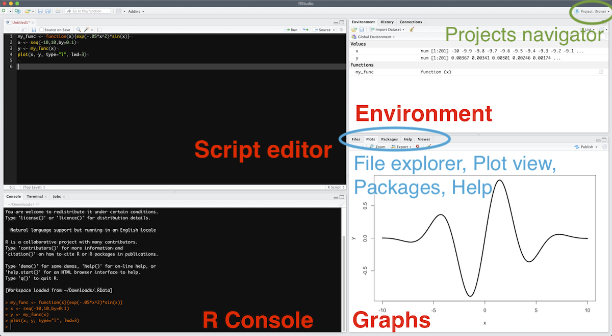

# Getting ready

## The easy way


- [Download](https://cran.r-project.org/) and install R
- [Download](https://www.rstudio.com/products/rstudio/download/#download) and install Rstudio
- **Windows only:** [Download](https://cran.r-project.org/bin/windows/Rtools/) and install Rtools
- You're good to go.

Launch Rstudio, click `File > New File > R script`. 

Write whatever you want in the "Source code" panel, and __run__ it by selecting it and hitting ⌘+⏎ (Ctrl+⏎ on Windows). If no text is selected, hitting ⌘+⏎ will launch the current line. 

The code output will be seen in the "R Console" panel if it's a text, or in the "Graph" panel if it's a graph. A list of all defined variables and functions is available in the "Environment" panel.

```{r, echo=FALSE}

```

More on the [Rstudio cheatsheet](https://github.com/rstudio/cheatsheets/raw/master/rstudio-ide.pdf).

## The more advanced way


If you don't want to use Rstudio but rather want to keep with your favorite text editor, like I do ([Sublime Text](https://www.sublimetext.com/3) (see configuration below), [Atom](https://atom.io/), [Visual Studio Code](https://code.visualstudio.com/)...)

- I still recommend [downloading](https://cran.r-project.org/) and installing R via CRAN (I had some packages problems due to a homebrew installation).
- To be fully operational with Rmarkdown files without using Rstudio, you need to install `pandoc`:
```bash
brew install openssl
brew install pandoc
brew install pandoc-citeproc
pip install pandoc-eqnos
pip install pandoc-fignos
pip install pandoc-tablenos
```

<details>
    <summary>**Configuring Sublime Text**</summary>

I personally use [Sublime Text 3](https://www.sublimetext.com/3). 

- First, install [Package control](https://packagecontrol.io/installation). 
- To set up command line launch: `ln -s "/Applications/Sublime Text.app/Contents/SharedSupport/bin/subl" /usr/local/bin/sublime`. 
- Install *a minima* the packages `LSP`, `R-IDE`, `Terminus`, and `SendCode`, and also the [radian](https://github.com/randy3k/radian) console. 
- You can also add the useful packages `LatexTools`, `BracketHighlighter`, `RainbowBrackets`, `Citer`, `Path Tools`, `SidebarEnhancements`, `SidebarTools`, `Git`, `GitGutter`, `Alignment`, `AutoFileName`. 
- Install the language server protocol package in R with: `install.packages("languageserver")`{.R}
- To create a keyboard shortcut to open a terminal with the radian console as the R interpreter, add this to your keybinding file:
```bash
{ "keys": ["super+option+r"], # put whatever you want here
    "command": "terminus_open",
    "args": {
        "post_window_hooks": [
            ["carry_file_to_pane", {"direction": "right"}]
        ],
        "cmd" : "radian"
    }
}
```
- Select `Terminus` as the destination of SendCode
- You should be good to go: ⌘+⏎ will send the current line/selection to the radian console, ⌘+B will render the current Rmd file, ⌘+\\ will set the working directory to the current file's folder.

</details>


## In any case: install LaTeX


A **full** $\LaTeX$ distribution (emphasis on **full**) will be needed to knit markdown files to PDFs (you don't need it to output html files though):

- Windows: go [here](https://miktex.org/download) and download the Net Installer to install the **complete distribution**
- Mac: go [here](https://tug.org/mactex/mactex-download.html) or type `brew cask install mactex` in the terminal if you have [Homebrew](https://treehouse.github.io/installation-guides/mac/homebrew) installed
- Linux: [here](https://dzone.com/articles/installing-latex-ubuntu) fore example

Alternatively, you can also work with [TinyTeX](https://yihui.name/tinytex/) that will install the needed packages on the fly. Just run this in the R console:

```r
install.packages("tinytex")
tinytex::install_tinytex()
# to uninstall TinyTeX, run tinytex::uninstall_tinytex()
```


## Setting up the environment

Make sure you have the following packages installed by launching the following commands: copy-paste them in the "Source code" panel (upper left after having crated a new R script), select all the lines and hit Ctrl+⏎ (Windows, Linux) or ⌘+⏎ (Mac).

```r
install.packages("devtools")
install.packages("tidyverse")
install.packages("rmarkdown")
install.packages("knitr")
install.packages("shiny")
```

Later on, a package can be loaded by calling:
```r
library(package_name)
```
or by checking it in the "Graph" panel under the "Packages" tab.
If you want to access a function from a given package without loading it (or because several packages define the same function and you want to specify which to use), type:
```r
package_name::function_name(parameters)
```
If you want to access the documentation on a given package, click the link on this package in the "Packages" tab.
In a more general way, help on a function is accessed by typing in `?function_name`, the help appearing in the "Graph" panel.


To get the path of your working environment, type in:
```{r}
getwd()
```

To set it to the directory you want:
```r
setwd("your/path/")
```

Or, to set it to the directory the current file is in, just click `Session > Set Working Directory > To Source File Location`.

