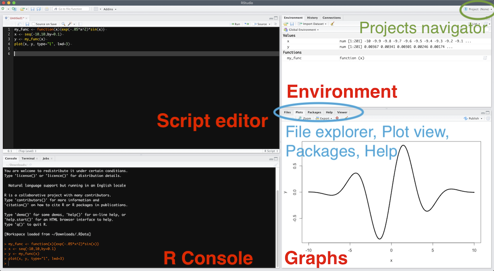

# Getting ready

<style type="text/css">
blockquote {
  background: #E9F9FF;
  border-left: 5px solid #026086;
  margin: 1.5em 10px;
  padding: 0.5em 10px;
}
</style>

## The easy way


- [Download](https://cran.r-project.org/) and install R
- [Download](https://www.rstudio.com/products/rstudio/download/#download) and install Rstudio
- **Windows only:** [Download](https://cran.r-project.org/bin/windows/Rtools/) and install Rtools
- You're good to go.

## The more advanced way

If you don't want to use Rstudio but rather want to keep with your favorite text editor, like I do ([Visual Studio Code](https://code.visualstudio.com/) or [Sublime Text](https://www.sublimetext.com/3),  see configuration below)

- I still recommend [downloading](https://cran.r-project.org/) and installing R via CRAN (I had some packages problems due to a `homebrew` installation on Mac).
- To be fully operational with Rmarkdown files without using Rstudio, you need to [install `pandoc`](https://pandoc.org/installing.html).

<details>
    <summary>**Configuring VS Code**</summary>

I personally use [VS Code](https://code.visualstudio.com/). 

- First, install the [radian](https://github.com/randy3k/radian) console.
- Install the language server protocol package in *R* with: `install.packages("languageserver")`{.R}
- In VS Code, install the following extensions:
    - [VSCode R](https://marketplace.visualstudio.com/items?itemName=Ikuyadeu.r)
    - [R LSP Client](https://marketplace.visualstudio.com/items?itemName=REditorSupport.r-lsp)
- Enable `r.bracketedPaste` for using Radian
- Set up `r.rterm.windows`, `r.rterm.mac` or `r.rterm.linux`: Path to Radian (where you installed radian)
- You should be good to go: ⌘+⏎ will send the current line/selection to the radian console and ⌘+Shift+K will render the current Rmd file.

Here is the relevant part of my `settings.json` file:
```json
{
    "r.rterm.mac": "/Library/Frameworks/Python.framework/Versions/3.9/bin/radian",
    "r.rpath.mac": "/usr/local/bin/R",
    "r.bracketedPaste": true,
    "r.lsp.diagnostics": false,
    "r.sessionWatcher": true,
    "r.rmarkdown.knit.useBackgroundProcess": false,
    "editor.guides.bracketPairs": true
}
```

Also, I recommend turning on the session watcher (`"r.sessionWatcher": true`), and then adding the following code to your `.Rprofile`. This way, the help, tables and figures can be viewed in the VS Code browser panel.

```r
options(vsc.browser = "Beside")
options(vsc.viewer = "Beside")
options(vsc.page_viewer = "Beside")
options(vsc.view = "Beside")
options(vsc.helpPanel = "Beside")

if (interactive() && Sys.getenv("TERM_PROGRAM") == "vscode") {
    if ("httpgd" %in% .packages(all.available = TRUE)) {
        options(vsc.plot = FALSE)
        options(device = function(...) {
            httpgd::hgd(silent = TRUE)
            .vsc.browser(httpgd::hgd_url(), viewer = "Beside")
        })
    }
}
```


<details><summary>**Here are also a few keybindings that I use (`keybindings.json`):**</summary>

```json
[
    {
        "description": "Create R terminal",
        "key": "alt+cmd+r",
        "command": "r.createRTerm"
    },
    {
        "description": "Insert code block",
        "key": "cmd+shift+i",
        "command": "editor.action.insertSnippet",
        "when": "editorTextFocus && editorLangId == 'rmd'",
        "args": {
            "snippet": "```{r}\n$0\n```"
            }
    },
    {
        "description": "Setwd to current file path",
        "key": "cmd+\\",
        "command": "r.runCommandWithEditorPath",
        "when": "editorTextFocus && editorLangId =~ /r|rmd/",
        "args": "setwd(dirname(\"$$\"))"
    },
    {
        "description": "Insert R arrow",
        "key": "ctrl+,",
        "command": "editor.action.insertSnippet",
        "when": "editorTextFocus && editorLangId =~ /r|rmd/",
        "args": {
            "snippet": " <- "
            }
    },
    {
        "description": "Insert pipe",
        "key": "ctrl+.",
        "command": "editor.action.insertSnippet",
        "when": "editorTextFocus && editorLangId =~ /r|rmd/",
        "args": {
            "snippet": " %>% "
         }
    },
    {
        "description": "help document",
        "key": "ctrl+h",
        "command": "r.runCommandWithSelectionOrWord",
        "when": "editorTextFocus && editorLangId =~ /r|rmd/",
        "args": "help($$)"
    },
    {
        "description": "view table",
        "key": "cmd+shift+u",
        "command": "r.runCommandWithSelectionOrWord",
        "when": "editorTextFocus && editorLangId =~ /r|rmd/",
        "args": "DT::datatable($$)"
    },
    {
        "description": "reopen figure panel if closed",
        "key": "ctrl+alt+p",
        "command": "r.runCommand",
        "when": "editorTextFocus && editorLangId =~ /r|rmd/",
        "args": ".vsc.browser(httpgd::hgd_url(), viewer = \"Beside\")"
    },
    {
        "description": "view object",
        "key": "cmd+u",
        "command": "r.runCommandWithSelectionOrWord",
        "when": "editorTextFocus && editorLangId =~ /r|rmd/",
        "args": "View($$)"
    }
]
```

</details>

</details>


<details>
    <summary>**Configuring Sublime Text**</summary>

I have personally used [Sublime Text 3](https://www.sublimetext.com/3) for a long time, but switched to [VS Code](https://code.visualstudio.com/) recently. Here is what I used to do: 

- First, install [Package control](https://packagecontrol.io/installation). 
- To set up command line launch: `ln -s "/Applications/Sublime Text.app/Contents/SharedSupport/bin/subl" /usr/local/bin/sublime`. 
- Install *a minima* the packages `LSP`, `R-IDE`, `Terminus`, and `SendCode`, and also the [radian](https://github.com/randy3k/radian) console. 
- You can also add the useful packages `LatexTools`, `BracketHighlighter`, `RainbowBrackets`, `Citer`, `Path Tools`, `SidebarEnhancements`, `SidebarTools`, `Git`, `GitGutter`, `Alignment`, `AutoFileName`. 
- Install the language server protocol package in R with: `install.packages("languageserver")`{.R}
- To create a keyboard shortcut to open a terminal with the radian console as the R interpreter, add this to your keybinding file:

```bash
{ "keys": ["super+option+r"], # put whatever you want here
    "command": "terminus_open",
    "args": {
        "post_window_hooks": [
            ["carry_file_to_pane", {"direction": "right"}]
        ],
        "cmd" : "radian"
    }
}
```
- Select `Terminus` as the destination of SendCode
- You should be good to go: ⌘+⏎ will send the current line/selection to the radian console, ⌘+B will render the current Rmd file, ⌘+\\ will set the working directory to the current file's folder.

</details>

## In any case: install LaTeX


A **full** $\LaTeX$ distribution (emphasis on **full**) will be needed to knit markdown files to PDFs (you don't need it to output html files though):

- **Windows:** go [here](https://miktex.org/download) and download the Net Installer to install the **complete distribution**
- **Mac:** go [here](https://tug.org/mactex/mactex-download.html) or type `brew cask install mactex` in the terminal if you have [Homebrew](https://treehouse.github.io/installation-guides/mac/homebrew) installed
- **Linux:** [here](https://dzone.com/articles/installing-latex-ubuntu) fore example

Alternatively, you can also work with [TinyTeX](https://yihui.name/tinytex/) that will install the needed packages on the fly. It is recommended on the `knitr` package help, but I only had problems with this, so I recommend the full $\LaTeX$ distribution option if you don't mind taking up a few gigabytes of your disk. If you do, just run this in the R console:

```r
install.packages("tinytex")
tinytex::install_tinytex()
```

To uninstall TinyTeX, run:
```r
tinytex::uninstall_tinytex()
```

## Working in Rstudio

> Remember: **Always Work with Projects!!**


Launch Rstudio, click `File > New Project`, and follow the dialog box (existing directory or not, etc.). When you have several ongoing projects, you can switch between them using the Project navigator (see Fig. \@ref(fig:rstudio)).

```{r rstudio, echo=FALSE, fig.cap="The Rstudio interface."}

```

The great interest of working with Projects is that the default working directory will be relative to the root directory of the Project. In other words, if you store your data in a `Data` folder, you can read it by running `read_function("Data/your_file.txt")`{.R}. This is one of the fundamentals of reproducible data treatment as:

- You won't have to write the absolute path towards your file, like `read_function("C://path/to/your_file.txt")`{.R}, path that is unlikely to be the same depending on the computer it is located on. This helps you share your whole project folder with others, or just move it around on your computer and still have a working code.
- You won't have to start your script by a `setwd("/path/to/your/data")`{.R} command (for set working directory), which is much better for the same reasons as above.

Write whatever you want in the "Source code" panel and save it in a `.R` (or `.Rmd`) file, and __run__ it by selecting it and hitting ⌘+⏎ (Ctrl+⏎ on Windows, Linux). If no text is selected, hitting ⌘+⏎ will launch the current line. You can see the file contents of your project in the project's file explorer (see bottom right corner of Fig. \@ref(fig:rstudio)).

The code output will be seen in the "R Console" panel if it's a text, or in the "Graph" panel if it's a graph. A list of all defined variables and functions is available in the "Environment" panel. You can also directly write and run code in the "R Console" panel, if it's code you don't care to save in a script (like installing a package or whatever).

You can install packages by running the `install.packages("package_name")`{.R} command in the R console or R script, or you can also click on the "Packages" tab in the bottom right corner, and then "Install" or "Update" in case you want to install or update your packages. "Update" will show you a list of installed packages that have a new published version. All verified packages are located on the CRAN (Comprehensive R Archive Network). It is thus really easy to install packages and maintain (update) your packages in R. There is also the possibility to install packages from source if you want to install custom packages -- "homemade" packages that didn't go through the CRAN verification process: do so at your own risks.

More on the [Rstudio cheatsheet](https://github.com/rstudio/cheatsheets/raw/master/rstudio-ide.pdf).


## Setting up the environment

Make sure you have the following packages installed by launching the following commands: copy-paste them in the "Source code" panel (upper left after having crated a new R script), select all the lines and hit Ctrl+⏎ (Windows, Linux) or ⌘+⏎ (Mac). These are the main packages that we will use in this class.

```r
install.packages("devtools")
install.packages("tidyverse")
install.packages("rmarkdown")
install.packages("knitr")
install.packages("shiny")
install.packages("patchwork")
install.packages("broom")
install.packages("plotly")
install.packages("quantities")
install.packages("minpack.lm")
install.packages("tikzDevice")
install.packages("ggforce")
```

Later on, a package can be loaded by calling:
```r
library(package_name)
```
or by checking it in the "Graphs" panel under the "Packages" tab.
If you want to access a function from a given package without loading it (or because several packages define the same function and you want to specify which one to use), type:
```r
package_name::function_name(parameters)
```

If you want to access the documentation on a given package, click the link on this package in the "Packages" tab.
In a more general way, help on a function is accessed by typing in `?function_name`, the help appearing in the "Graph" panel.

