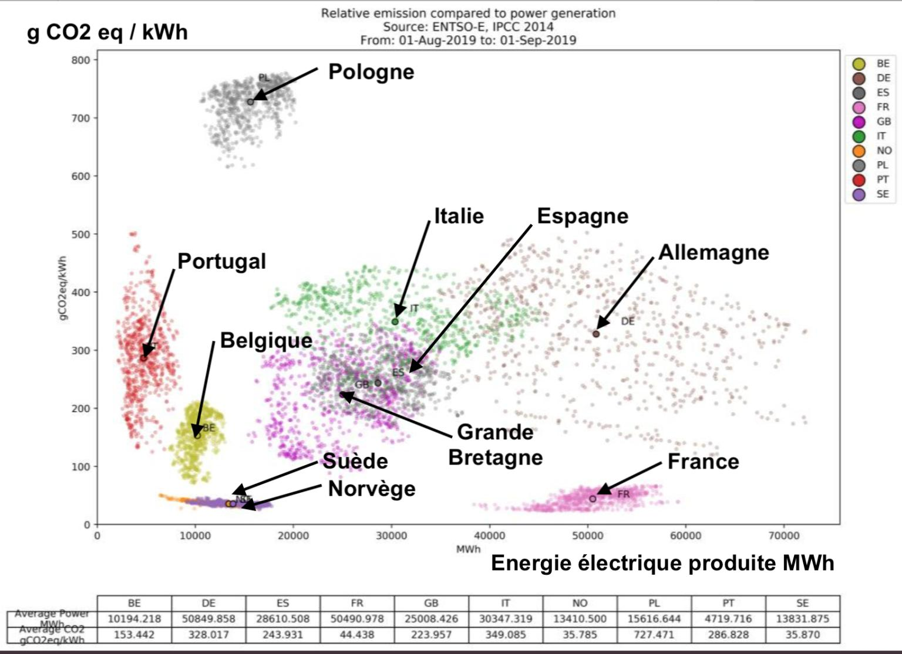
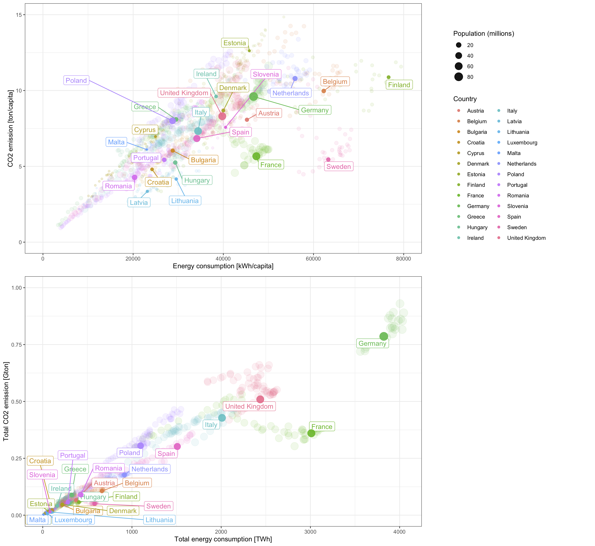

# Plotting


**Now that we have seen most of the basics, let's start the fun stuff !**

There are two main ways to plot data in R:

- Using base graphics, the native R plotting device
- Using the package `ggplot2` and tidy data frames

`ggplot2` is extremely powerful and some people advise not even teaching base graphics to beginners. But I find that some times it's just quicker/easier with base graphics, so I will still present it, although not in full details.


## Base graphics


### Basic plotting
```{r, warnings=FALSE}
x  <- seq(-3*pi,3*pi,length=50)
y  <- sinc(x)
z  <- sinc(x)^2
df <- data.frame(x=x, y=y)
plot(x,y) # plot providing x and y data
plot(df)  # plot providing a two-columns data.frame
plot(df, type="l")
plot(df, type="b")
df <- data.frame(x=x, y=y, z=z, w=z*y)
plot(df)  # plot providing a multi-columns data.frame
```

### Adding some style
OK, easy. Now let's do some tuning of this, because it's a tad ugly...
Type in each command and see what they do.
```{r, warnings=FALSE}
# create some fake data
x  <- seq(-3*pi,3*pi,length=100)
df <- data.frame(x=x, y=sinc(x), z=sinc(x)^2)
# add some styling parameters
par(family = "Helvetica", cex.lab=1.5, cex.axis=1.4, 
    mgp = c(2.4, .5, 0), tck=0.02, mar=c(4, 4, 2, .5), lwd=2, las=1)
plot(df$x,df$y,
     type = "l",     # "l" for lines, "p" for points
     xlab = "X values",
     ylab = "Intensity",
     axes = FALSE,
     main = "Some Plot"
    )
# vertical line in 0
abline(v=0,lty=2,lwd=2)
# horizontal line in 0
abline(h=0,lty=3,lwd=2)
# line with coefficients a (intercept) and b (slope)
abline(a=0,b=.1,lty=4,lwd=1)
# add a line
lines(df$x,df$z,type = "l",col="red",lwd=3)
# add points
points(df$x,df$z*df$y,col="royalblue",pch=16,cex=1)
# add custom axis. 
# Default with axis(1);axis(2);axis(3, labels=FALSE);axis(4, labels=FALSE);
# Bottom
axis(1,at=seq(-10,10,2),labels=TRUE,tck=0.02)
axis(1,at=seq(-10,10,1),labels=FALSE,tck=0.01); # small inter-ticks
# Top
axis(3,at=seq(-10,10,2),labels=FALSE)
axis(3,at=seq(-10,10,1),labels=FALSE,tck=0.01); # small inter-ticks
# Left
axis(2,at=seq(-1,1,.2),labels=TRUE)
axis(2,at=seq(-1,1,.1),labels=FALSE,tck=0.01); # small inter-ticks
# Right
axis(4,at=seq(-1,1,.2),labels=FALSE)
axis(4,at=seq(-1,1,.1),labels=FALSE,tck=0.01); # small inter-ticks
# Draw a box
box()
# Print legend
legend("topleft",
    cex=1.4, #size of text
    lty=c(1,1,NA),   # type of line (1 is full, 2 is dashed...)
    lwd=c(1,3,NA),   # line width
    pch=c(NA,NA,16), # type of points
    col=c("black","red","royalblue"), # color
    bty = "n", # no box around legend
    legend=c("sinc(x)",expression("sinc(x)"^2),expression("sinc(x)"^3))
    )
```

Most needs should be covered with this simple plot that can be adapted.

A plot can be exported if surrounded by `XXX` and `dev.off()`, with `XXX` that can be `pdf("xxx.pdf",height=6, width=8)`, `png("xxx.png",height=6, width=8)`... Example:
```r
pdf("test.pdf",height=6, width=8)
plot(x,y,
     type="l",
     xlab="x"
     )
dev.off()
```

You can also export the graph as a `.tex` file using `tikz`, which allows you to use $\LaTeX$ mathematical expressions (don't forget to escape the `\` character):
```r
library(tikzDevice)
tikz("plot.tex",height=6, width=8,pointsize = 10,standAlone=TRUE)
plot(x,y,
     type="l",
     xlab="\\omega_i"
     )
dev.off()
```

<details>
    <summary>**Pro Tip: make a _code snippet_**</summary>

Go to Rstudio **Preferences**, **Code**, **Edit code snippets**, and add the following lines:

```r
snippet plot
    #pdf("xxx.pdf", height=6, width=8)
    par(cex.lab=1.7, cex.axis=1.7, mgp = c(3, 0.9, 0), 
        tck=0.02, mar=c(4.5, 4.5, 1, 1), lwd = 3, las=1)
    plot(${1:x},${2:y},
        type="l",      # plot with a line
        ylim=c( , ),
        xlim=c( , ),
        lwd=2,         # width of the line
        lty=1,         # type of line
        axes=FALSE,    # do not show axes
        xlab="${1:x}", # x label
        ylab="${2:y}", # y label
        main="")       # Title
    legend("topright",
        cex=1.5,       # size of the text
        pch=c(),       # list of point types
        lty=c(),       # list of line types
        lwd=c(),       # list of line widths
        col=c(),       # list of line colors
        bty="n",       # no box around the legend
        legend=c()     # list of legend labels
        )
    # Draw axes with minor ticks
    axis(1, at=seq(0,1,.2), labels=TRUE)
    axis(1, at=seq(0,1,.1), labels=FALSE, tck=0.01)
    axis(3, at=seq(0,1,.2), labels=FALSE)
    axis(3, at=seq(0,1,.1), labels=FALSE, tck=0.01)
    par(mgp = c(2.5, 0.2, 0))
    axis(2, at=seq(0,10,1), labels=TRUE)
    axis(2, at=seq(0,10,.5), labels=FALSE, tck=0.01)
    axis(4, at=seq(0,10,1), labels=FALSE)
    axis(4, at=seq(0,10,.5), labels=FALSE, tck=0.01)
    box() # drow box around plot
    #dev.off()

snippet ggplot
    library(ggplot2)
    ggplot(data=${1:df}, aes(x=${2:x}, y=${3:y}, color=${4:z}, size=${5:w})) +
        geom_point() +
        geom_smooth() +
        theme_bw()
```
</details>


<details>
    <summary>**Exercise**</summary>

Try reproducing these plots:

```{r, echo=FALSE}
Gaussian <- function(x,x0,FWHM,A=1,y0=0){
    y0 + 2.*A*sqrt(2*log(2))/sqrt(2*pi)/FWHM*exp(-(x-x0)^2*4*log(2)/FWHM^2)
}
par(family = "Helvetica", cex.lab=1.5, cex.axis=1.4, 
    mgp = c(2.4, .5, 0), tck=0.02, mar=c(4, 4, 2, .5), lwd=2, las=1)
x <- seq(-10,10,.5)
plot(x,sin(x),type="b")
plot(x,sin(x),type="l", lwd=5, lty=2)
points(x,sin(x),cex=3, col="blue", pch=2)
abline(h=0, col="red")
x <- seq(30,80,.01)
plot(x, Gaussian(x,40,1)+Gaussian(x,50,2)+Gaussian(x,70,5), 
    type="l", ylim=c(0,1), xlab="Raman Shift [1/cm]",
    ylab="Intensity [arb. units]", lwd=2)
legend("topright",
    cex=1.7,
    lty=c(1),
    lwd=c(2),
    col=c("black"),
    bty = "n",
    legend=c("Some Raman spectrum")
    )
axis(3, labels=FALSE)
axis(4, labels=FALSE)
```

</details>

### Going further

#### Panel plots

Lets create a plot with different panels (a bit ugly without styling, you need to tweak the margins and text distance to plot with `par(mar(), mgp())` before each plot):

```{r, fig.height=6, fig.width=6}
# some fake data
x  <- seq(-10,10,1)
d1 <- data.frame(x=x, y=sin(x))
d2 <- data.frame(x=x, y=sinc(x))
d3 <- data.frame(x=x, y=exp(-x^2)*sinc(x)^2)
# on a simple grid, use:
# par(mfrow=c(nrows, ncols))
par(mfrow=c(1, 3), mar=c(4,4,1,1))
plot(d1,type="l")
plot(d2,type="p")
plot(d3,type="b")
```

```{r, fig.height=6, fig.width=6}
# creating the layout and styling
M  <- matrix(c(c(1,1),c(2,3)), byrow=TRUE, ncol=2); M
nf <- layout(M, heights=c(1), widths=c(1))
# first plot
plot(d1,type="l")
# second plot
plot(d2,type="p")
# third plot
plot(d3,type="b")
```

```{r, fig.height=6, fig.width=6}
# creating the layout and styling
M  <- matrix(c(c(1,1),c(2,3)), byrow=FALSE, ncol=2); M
nf <- layout(M, heights=c(1), widths=c(1))
# first plot
plot(d1,type="l")
# second plot
plot(d2,type="p")
# third plot
plot(d3,type="b")
```

#### Barplots and densities


```{r, warnings=FALSE}
x <- rnorm(1e4, mean = 0, sd = 1)
# Barplot
hist(x)
# Density
y  <- density(x, bw=0.1) # small kernel bandwidth
y2 <- density(x, bw=0.5) # larger kernel bandwidth
plot(y, lwd=2, main="", xlab="X values", xlim=c(-4,4))
lines(y2,col="red",lwd=2)
points(x, jitter(rep(.01,length(x)), amount=.01), 
        cex=1,pch=16, col=adjustcolor("royalblue", alpha=.01))
```

<details>
    <summary>**Exercise**</summary>

Plot the histogram of the age distribution in the class.

</details>


## Advanced plotting using ggplot2

Further (more detailed) reading [here](http://tutorials.iq.harvard.edu/R/Rgraphics/Rgraphics.html) and on the [cheatsheet](https://github.com/rstudio/cheatsheets/raw/master/data-visualization-2.1.pdf) for example.

`ggplot2` is a package (now even available for python) that completely changes the methodology of plotting data. With `ggplot2`, data are gathered in a **tidy** `data.frame`, and each column can be used as a parameter to tweak colors, point size, etc.

First things first, load the library:
```r
library(ggplot2)
```

### A quick plot

A quick plot can be made using the function `qplot` (for "quickplot"), very similar to the base graphics `plot` function. It's great for allowing you to produce plots quickly, but it is highly recommended learning `ggplot()` as it makes it easier to create complex graphics. 

Note how different is the default theme of the plot:

```r
# some fake data
x  <- seq(-10,10,.5)
y  <- sinc(x)
p1 <- qplot(x,y, geom="line") # ggplot2 quick plot
p2 <- qplot(x,y, geom="point") # ggplot2 quick plot
p1; p2
```
```{r, echo=FALSE, warnings=FALSE, message=FALSE}
# some fake data
x  <- seq(-10,10,.5)
y  <- sinc(x)
p1 <- qplot(x,y, geom="line") # ggplot2 quick plot
p2 <- qplot(x,y, geom="point") # ggplot2 quick plot
library(cowplot)
plot_grid(p1,p2, labels=c("P1", "P2"))
```


### The grammar of graphics

With `ggplot2` is introduced the notion of "grammar of graphics" through the function `ggplot()`. What it means is that the plots are built through independent blocks that can be combined to create any wanted graphical display.
To construct a plot, you need to provide building blocks such as:

- data gathered in a *tidy* data.frame
- an *aesthetics* mapping: what column is *x*, *y*, the color, the size, etc...
- geometric object: points, lines, bars...
- statistical transformations
- scales
- coordinate system
- position adjustments
- faceting

Since a figure is worth a thousand words, let's get to it. We will use the dataset `diamonds` built-in with the `ggplot2` package. Let's have a look:

```{r, warnings=FALSE}
diamonds
```

`diamonds` contains 53940 lines and 10 columns in a `tibble`. `ggplot` can easily handle such large dataset.

Let's say we want to see whether there is a correlation between price and weight (carat) of the diamonds:

```{r, warnings=FALSE}
p <- ggplot(data=diamonds,aes(x=carat,y=price))
p + geom_point()
```

OK, we're onto something, but we can probably add some information to this plot. We will first cut the data above 3 carats because they are not relevant, and add some transparency to the points to see some statistical information.

```{r, warnings=FALSE}
p <- ggplot(data=subset(diamonds, carat<=3),
            mapping=aes(x=carat,y=price))
p + geom_point(alpha=0.5)
```

Let's now see whether the clarity plays a role here by coloring the points according to the diamonds cut:
```{r, warnings=FALSE}
p <- ggplot(data=subset(diamonds, carat<=3),
            mapping=aes(x=carat,y=price, color=cut))
p + geom_point(alpha=0.5)
```

It looks like the price dispersion is homogeneous, we can make sure by adding a spline smoothing:
```{r, warning = FALSE, message=FALSE}
p + geom_point(alpha=0.5) + geom_smooth()
```

The slope evolution shows that in general, the better the cut, the higher the price. But there are some discrepancies that may be explained in another manner:
```{r, warnings=FALSE}
p <- ggplot(data=subset(diamonds, carat<=3),
            mapping=aes(x=carat,y=price, color=clarity))
p + geom_point(alpha=0.5) + geom_smooth()
```

It is often easier to grasp a multi-variable problem by plotting all our data in a facet plot using `facet_wrap()`
```{r, warning = FALSE, message=FALSE}
colors <- rainbow(length(unique(diamonds$clarity)))
p <- ggplot(diamonds, aes(x=price,y=carat)) + 
        geom_point(aes(color=clarity), alpha=0.5, size=1) + 
        geom_smooth(color="black") + 
        scale_colour_manual(values = colors, name="Clarity") +
        facet_wrap(~cut) 
p
```

Or by adding another graphical parameter such as the size of the points:
```{r, warnings=FALSE}
p <- ggplot(diamonds, aes(x=price,y=carat, size=cut)) + 
        geom_point(aes(color=clarity), alpha=0.5) + 
        scale_colour_manual(values = colors, name="Clarity")
p
```

OK, maybe not here because the graph gets clogged, so we can lighten it by sampling data:
```{r, warnings=FALSE}
p <- ggplot(diamonds[sample(nrow(diamonds), size=500),], 
            aes(x=carat,y=price, size=cut)) + 
        geom_point(aes(color=clarity), alpha=0.5) + 
        scale_colour_manual(values = colors, name="Clarity")
p
```

### Theming

It is very easy to keep the same theme on all your graphs thanks to the `theme` function.
There are a collection of pre-defined themes, like:
```{r, warnings=FALSE}
p + theme_grey() # the default
p + theme_classic()
p + theme_bw()
p + theme_minimal()
p + theme_dark()
p + theme_light()
```

You can define all the parameters you want, like this (hit `?theme` like usual to see all the parameters):

```{r, warnings=FALSE}
my_theme <- theme_bw()+
            theme(axis.text = element_text(size = 14,family = "Helvetica",colour="black"),
                  text = element_text(size = 14,family = "Helvetica"),
                  axis.ticks = element_line(colour = "black"),
                  legend.text = element_text(size = 14,family = "Helvetica",colour="black"),
                  panel.border = element_rect(colour = "black", fill=NA, size=1),
                  legend.key.height=unit(0.5,"cm")
                  )
p + my_theme
```

### Making interactive plots with ggplot2 and plotly

Thanks to the `plotly` package, it is really easy to transform a `ggplot` plot into an interactive plot:
```{r, include=FALSE, warning = FALSE, message=FALSE}
library(plotly)
```
```r
# load plotly
library(plotly)
```
```{r, warnings=FALSE}
p <- ggplot(diamonds[sample(nrow(diamonds), size=100),], 
        aes(x=carat,y=price)) + 
        geom_point(aes(color=clarity), alpha=0.5, size=2) + 
        my_theme
ggplotly(p, dynamicTicks = TRUE)
```


### Gathering plots on a grid

If you have several plot you want to gather on a grid and you can't use `facet_wrap` (because they come from different data sets), you can use the library `cowplot` and its function [plot_grid()](https://cran.r-project.org/web/packages/cowplot/vignettes/plot_grid.html):

```{r, message=FALSE}
library(ggplot2)
library(cowplot)
x  <- seq(-2*pi,2*pi,.1)
p1 <- qplot(x, sin(x), geom="line")
p2 <- qplot(x, cos(x), geom="line")
p3 <- qplot(x, atan(x), geom="line")
p4 <- qplot(x, dnorm(x), geom="line")
plot_grid(p1, p2, p3, p4, 
            labels=c("a)","b)","c)","d)"), 
            ncol=3, align = 'v', axis = 'l')
plot_grid(p1, p2, p3, p4, labels=c("a)","b)","c)","d)"), nrow=2)
```

Alternatively, you can also use the [patchwork](https://patchwork.data-imaginist.com/articles/patchwork.html) package:
```{r include=TRUE, warning = FALSE, message=FALSE, cache=FALSE}
library(patchwork)
p1 + p2
p1 + p2 / p3 + p4 + plot_annotation(tag_levels = 'a', tag_suffix=")")
(p1+p2)/p3/p4
```


## Exercises


<details>
    <summary>**Exercise 1**</summary>

**Using base graphics**

- Load <a href="Data/FTIR_rocks.xlsx" download target="_blank">FTIR_rocks.xlsx</a> into a data.frame
- Plot the three FTIR spectra with three different colors
- Add a legend
- Add a text annotation marking the frequency of the most intense peak for each spectrum
    + First, find the position of the most intense peak in each spectrum, and store it
    + Then, find the intensity value of the most intense peak in each spectrum, and store it
- Add a dashed vertical line at 3420cm<sup>-1</sup>
- Do the same plot with `ggplot2`. Don't forget to tidy the data up.
- Make the plot interactive


<details>
    <summary>Solution</summary>

```{r, warnings=FALSE}
# Load <a href="Data/FTIR_rocks.xlsx" download target="_blank">FTIR_rocks.xlsx</a> into a data.frame
library(readxl)
df <- read_excel("Data/FTIR_rocks.xlsx")
head(df)
names(df)[1] <- "w"
# Find the position of the largest peak in each spectrum
xmax1 <- round(df$w[which.max(df$'rock 1')], 2)
xmax2 <- round(df$w[which.max(df$'rock 2')], 2)
xmax3 <- round(df$w[which.max(df$'rock 3')], 2)
# Find the intensity value of the largest peak in each spectrum
ymax1 <- max(df[['rock 1']])
ymax2 <- max(df[['rock 2']])
ymax3 <- max(df[['rock 3']])
# Define the colors
colors <- c("black", "royalblue","red")

# BASE GRAPHICS Solution
par(cex.lab=1.4, cex.axis=1.4, mgp = c(3, 0.9, 0), 
    tck=0.02, mar=c(4.5, 4.5, 1, 1),lwd=2, las=1)
plot(df[['w']], df[['rock 1']], 
    type = "l", 
    col  = colors[1],
    lwd  = 3,
    ylim = c(0,1),
    xlab = "Wavenumber [1/cm]",
    ylab = "Intensity [arb. units]")
lines(df[['w']], df[['rock 2']], lwd=3, col=colors[2])
lines(df[['w']], df[['rock 3']], lwd=3, col=colors[3])
# Add a legend
legend("topleft",
    cex    = 1.2, lwd=3,
    col    = colors,
    bty    = "n",
    legend = names(df)[2:4])
# Add a dashed vertical line at 3420cm-1
abline(v= 3420, lty=2)
# Add a text annotation marking the frequency 
# of the most intense peak for each spectrum
text(x     = c(xmax1,xmax2,xmax3), 
     y     = c(ymax1,ymax2,ymax3)+.03,
     label = c(xmax1,xmax2,xmax3),
     col   = colors)


# GGPLOT2 Solution
library(tidyr)
df_tidy <- pivot_longer(df, cols=-w, 
                        names_to="Rock", 
                        values_to="Intensity")
theme_set(theme_bw())

p <- ggplot(df_tidy, aes(x=w, y=Intensity, color=Rock))+
        geom_line(size=1)+
        labs(x="Wavenumber [1/cm]", 
             y="Intensity [arb. units]")+
        scale_color_manual(values=colors, name="Rock: ")+
        ylim(c(0,1))+
        geom_vline(xintercept=3420, linetype=2)+
        annotate("text", 
                   x= c(xmax1,xmax2,xmax3), 
                   y= c(ymax1,ymax2,ymax3)+.03,
                   label= c(xmax1,xmax2,xmax3),
                   color=colors
                )+
        theme(legend.position='top')
p
plotly::ggplotly(p, dynamicTicks = TRUE)
```

</details>
</details>

<details>
    <summary>**Exercise 2**</summary>

- Download the TGA data file <a href="Data/ATG.txt" download target="_blank">ATG.txt</a>
- Load it into a `data.frame`.
- Plot the mass as a function of the temperature `Ts` with lines, using base graphics and then `ggplot2`
    + Remove data from the temperature decrease
    + Define nice axis labels with the units
    + Add `mass` vs. `Tr` as a blue dashed line
    + Convert degrees Celsius to Kelvins
- Write a function returning the derivative of a `data.frame` 
    + Add the derivative in a red dashed line in a panel below the previous graph
    + Zoom on the data to see the variations
    + Remove the x label of the top panel and have the same x axis for both panels

<details>
    <summary>Solution</summary>

```{r}
# Download the TGA data file <a href="Data/ATG.txt" download target="_blank">ATG.txt</a>
# Load it into a `data.frame`.
d <- read.table("Data/ATG.txt", 
                skip=12,
                header=FALSE, 
                nrows=4088)
names(d) <- c("Index", "t", "Ts", "Tr", "Value")
head(d)
# Plot the mass as a function of the temperature `Ts` with lines, using base graphics and then `ggplot2`
# Remove data from the temperature decrease
d <- subset(d, t < d$t[which.max(d$Ts)])
# Define nice axis labels with the units
# Add `mass` vs. `Tr` as a blue dashed line
# Convert degrees Celsius to Kelvins
plot(d$Ts+273.15, d$Value, 
    type="l", 
    xlab="T [K]", 
    ylab="Mass [mg]")
lines(d$Tr+273.15, d$Value, col="blue", lty=2)
library(ggplot2)
ggplot(data=d, aes(x=Ts+273.15, y=Value)) +
     geom_line() +
     geom_line(aes(x=Tr+273.15, y=Value), col="blue", lty=2) +
     labs(x="T [K]", y="Mass [mg]") +
     theme_bw()
# Write a function returning the derivative of a `data.frame` 
derivative <- function(x, y, n=1) {
  # returns d^ny/dx^n
  d <- data.frame(x=x,y=y)
  for (i in 1:n) {
    x  <- d$x
    y  <- d$y
    dy <- diff(y)/diff(x)# the actual derivative
    dx <- x[-length(x)]+diff(x)/2# centers the X values
    d  <- data.frame(x=dx,y=dy)
  }
  d
}
dd <- derivative(d$Ts,d$Value)
# Add the derivative in a red dashed line in a panel below the previous graph
# Zoom on the data to see the variations
# Remove the x label of the top panel and have the same x axis for both panels
# ---- base graphics
M  <- matrix(c(1,2), byrow=TRUE, nrow=2)
nf <- layout(M, heights=c(1,.5), widths=c(1))
par(cex.lab=1.5, cex.axis=1.5, mgp = c(3, 0.5, 0), 
    tck=0.02, mar=c(.5, 4.5, 1, 1), las=1, lwd=2)
plot(d$Ts+273.15, d$Value, 
    xlim=c(300, 1200),
    type="l", 
    axes=FALSE,
    xlab="T [K]", 
    ylab="Mass [mg]")
axis(2);axis(4, labels=FALSE);
axis(1, labels=FALSE);axis(3, labels=FALSE);
box()
par(mar=c(4.5, 4.5, 0, 1))
plot(dd$x+273.15, dd$y, 
    ylim=c(-.15,.05),
    xlim=c(300, 1200),
    col="red", 
    type="l",
    axes=FALSE,
    lty=2, 
    xlab="T [K]", ylab="Derivative")
axis(1, labels=TRUE, tck=0.06)
axis(2, labels=TRUE, tck=0.06)
axis(3, labels=FALSE, tck=0.06)
axis(4, labels=FALSE, tck=0.06)
box()
# ---- ggplot2
p1 <- ggplot(data=d, aes(x=Ts+273, y=Value)) +
         geom_line() +
         labs(x="", y="Mass [mg]") +
         theme_bw() +
         theme(axis.text.x=element_blank())
p2 <- ggplot(data=dd, aes(x=x+273, y=y), color="red") +
         geom_line(col="red", lty=2) +
         ylim(c(-.15,.05))+
         labs(x="T [K]", y="Derivative") +
         theme_bw()
library(cowplot)
plot_grid(p1,p2, ncol=1, align = 'v', axis = 'l', rel_heights = c(1,.4))
```

</details>
</details>


<details>
    <summary>**Exercise 3**</summary>

**Using base graphics:**

- Download the two sample Raman spectra: <a href="Data/PPC60_G_01.txt" download target="_blank">PPC60_G_01.txt</a> and <a href="Data/PPC60_G_30.txt" download target="_blank">PPC60_G_30.txt</a>
- Load them in two separate `data.frame`
- Plot them together using base graphics, one in red lines, one in blue points
    + Is the y axis alright? correct it if needed
- Add the corresponding legend where you see fit (*e.g.* top left corner)
- Create a function `norm01` to normalize data to [0,1]
- Do the same plot with data normalized to [0,1]
- Play with the theme to reproduce the following plot:

```{r, echo=FALSE}
# Load them in two separate `data.frame`
df1 <- read.table("Data/PPC60_G_01.txt", col.names=c("w","Int"))
df2 <- read.table("Data/PPC60_G_30.txt", col.names=c("w","Int"))
# Plot them together using base graphics, one in red lines, one in blue points
norm01 <- function(x) {(x-min(x))/(max(x)-min(x))}
par(family = "Times", cex.lab=1.5, cex.axis=1.4, 
    mgp = c(2.4, .5, 0), tck=0.02, mar=c(4, 4, .5, .5), lwd=2, las=1)
plot(df1$w, norm01(df1$Int),
    xlab="Raman Shift [1/cm]",
    ylab="Intensity [arb. unit]",
    type="l", 
    col="red", 
    ylim=c(0,1), 
    lwd=3)
points(df2$w, norm01(df2$Int), col="royalblue", pch=16, cex=1)
axis(3, labels=FALSE)
axis(4, labels=FALSE)
legend("topleft",
    cex=1.4,
    lty=c(1, NA),
    lwd=c(3, NA),
    pch=c(NA, 16),
    col=c("red", "royalblue"),
    bty = "n",
    legend=c("PPC60_G_01", "PPC60_G_30")
    )
```

**Using ggplot2:**

- Gather the two `data.frame` in a single tidy one, and do an equivalent plot in `ggplot2`
- What are the difficulties you encountered in each case (base graphics and ggplot)? You now see that each graphics has its perks and downsides.


<details>
    <summary>Solution</summary>

```{r}
# Load them in two separate `data.frame`
df1 <- read.table("Data/PPC60_G_01.txt", col.names=c("w","Int"))
df2 <- read.table("Data/PPC60_G_30.txt", col.names=c("w","Int"))
norm01 <- function(x) {(x-min(x))/(max(x)-min(x))}
# Plot them together using base graphics, one in red lines, one in blue points
par(family = "Times", cex.lab=1.5, cex.axis=1.4, 
    mgp = c(2.4, .5, 0), tck=0.02, mar=c(4, 4, .5, .5), lwd=2, las=1)
plot(df1$w, norm01(df1$Int),
    xlab="Raman Shift [1/cm]",
    ylab="Intensity [arb. unit]",
    type="l", 
    col="red", 
    ylim=c(0,1), 
    lwd=3)
points(df2$w, norm01(df2$Int), col="royalblue", pch=16, cex=1)
axis(3, labels=FALSE)
axis(4, labels=FALSE)
legend("topleft",
    cex=1.4,
    lty=c(1, NA),
    lwd=c(3, NA),
    pch=c(NA, 16),
    col=c("red", "royalblue"),
    bty = "n",
    legend=c("PPC60_G_01", "PPC60_G_30")
    )
# Gather them in a single tidy `data.frame`, and do the same in `ggplot2`
df1$name <- "PPC60_G_01"
df1$norm <- norm01(df1$Int)
df2$name <- "PPC60_G_30"
df2$norm <- norm01(df2$Int)
df <- rbind(df1, df2)
library(ggplot2)
ggplot(df, aes(x=w, y=norm)) +
    geom_line(data=subset(df, name=="PPC60_G_01"), size=1, aes(color=name))+
    geom_point(data=subset(df, name=="PPC60_G_30"), size=2, aes(color=name))+
    scale_color_manual(values=c("red","royalblue"), name="") +
    labs(x="Raman Shift [1/cm]", y="Intensity [arb. unit]") +
    theme_bw() +
    theme(legend.position = c(0.15,.87),
          text = element_text(size = 16,family = "Times"),
          axis.text = element_text(size = 16),
          legend.text = element_text(size = 14),
          panel.grid.major = element_blank(), 
          panel.grid.minor = element_blank())
```


</details>

</details>


<details>
    <summary>**Exercise 4**</summary>

**Using base graphics:**

- Load the `trees` dataset and create a scatter plot of the height as a function of girth.
- Add the volume vs girth as a red line
- Adjust the axis labels so that they are nicer
- Adjust the scale so that all data are visible
- Make it so that the left axis is the height and the right axis is the volume (in red)
- Suppose you want to add two new observations to the previous plot, but you want to identify them on the graph. Using the points function add the new observations to the last plot using blue to identify them, and make them bigger too. The values of the new observation are Girth = [18, 20] and height = [72, 81].
- Do the same plot with `ggplot2`

<details>
    <summary>Solution</summary>

```{r}
par(cex.lab=1.5, cex.axis=1.5, mgp = c(3, 0.9, 0), 
    tck=0.02, mar=c(4.5, 4.5, 1, 4.5), las=1)
plot(trees$Girth,trees$Height,type="p",
    xlab="Girth", ylab="Height",
    ylim=c(0,100),
    axes=FALSE,
    pch=16)
lines(trees$Girth,trees$Volume, col="red", lwd=2)
points(c(18, 20), c(72, 81), col="blue", pch=16, cex=3)
mtext(side=4, line=3, "Volume", las=0, cex=1.7, col="red")
box()
axis(1,labels=TRUE)
axis(3,labels=FALSE)
axis(2,labels=TRUE)
axis(4,labels=TRUE, col="red", col.ticks="red", col.axis="red")

library(ggplot2)
ggplot(data=trees, aes(x=Girth))+
    geom_point(aes(y=Height), size=3)+
    annotate("point", x=c(18, 20), y=c(72, 81), size=6, color="blue") +
    geom_line(aes(y=Volume), color="red", size=1)+
    scale_y_continuous(sec.axis = sec_axis(~., name = "Volume"), limits = c(0, 100))+
    theme_bw()+
    theme(axis.text          = element_text(size = 14),
          text               = element_text(size = 14),
          axis.line.y.right  = element_line(color = "red"), 
          axis.ticks.y.right = element_line(color = "red"),
          axis.text.y.right  = element_text(color = "red"),
          axis.title.y.right = element_text(color = "red"))
```

</details>
</details>


<details>
    <summary>**Exercise 5**</summary>

**Using base graphics:**

- Download <a href="Data/rubis_01.txt" download target="_blank">rubis_01.txt</a>, <a href="Data/rubis_02.txt" download target="_blank">rubis_02.txt</a>, <a href="Data/rubis_03.txt" download target="_blank">rubis_03.txt</a> and <a href="Data/rubis_04.txt" download target="_blank">rubis_04.txt</a> and load them into a list (each element of the list corresponding to a spectrum).
- Normalize all data to [0,1]
- Plot the 4 spectra on top of each other with a vertical shift of 1, with a different color for each spectrum
- Annotate on the base line with the name of the file
- Do the same with `ggplot2` after having loaded the data into a tidy `tibble`

<details>
    <summary>Solution</summary>

```{r, warnings=FALSE}
spec <- list()
for (i in 1:4) {
    d  <- read.table(paste("Data/rubis_0",i,".txt", sep=""), 
                        header=FALSE, col.names=c("w", "Int"))
    d$Int  <- norm01(d$Int)
    spec[[paste("rubis_0",i, sep="")]] <- d
}
par(cex.lab=1.5, cex.axis=1.5, mgp = c(3, 0.9, 0), tck=0.02, 
    mar=c(4.5, 4.5, 1, 1), las=1)
plot(NA, NA,
    ylim=c(0,4),
    xlim=c(3050,3350),
    lwd=2,axes=FALSE,
    xlab="Raman Shift [1/cm]",
    ylab="Intensity [arb. units]",)
axis(1,labels=TRUE)
axis(3,labels=FALSE)
axis(2,labels=FALSE); axis(4,labels=FALSE)
box()
i <- 1
for (name in names(spec)) {
    lines(spec[[name]]$w, spec[[name]]$Int + i - 1, col=i, lwd=2)
    text(3080, i - 1 + .15, name, cex=1.5)
    i <- i+1
}


# # # # # # # # # # # # # # # 
library(tidyverse)
library(ggplot2)
df <- tibble()
for (i in 1:4) {
    d  <- read_table2(paste("Data/rubis_0",i,".txt", sep=""), col_names=c("w", "Int"))
    d$Int  <- norm01(d$Int)
    d$name <- paste("rubis_0",i, sep="")
    df <- bind_rows(df, d)
}
fnames <- unique(df$name)
ggplot(data=df, aes(x=w, y=Int+as.numeric(factor(name))-1, color=name))+
    geom_line(size=1)+
    theme_bw()+
    annotate("text", x=3080, y=1:length(fnames)-.85, label=fnames, size=5)+
    labs(x="Raman Shift [1/cm]", y="Intensity [arb. units]")+
    theme(legend.position = "none",
          text            = element_text(size = 14),
          axis.text.y     = element_blank(),
          axis.text       = element_text(size = 14))

```


</details>
</details>


<details>
    <summary>**Exercise 6**</summary>


- Download <a href="Data/population.csv" download target="_blank">population.csv</a> and load it into a `data.frame`
- Is it a tidy `data.frame`?
    + Do we want a tidy `data.frame`?
    + Why?
    + Act accordingly
- Plot the population vs. year with a color for each city
    + With points
    + With lines
    + With a black and white theme
    + Change the axis labels to "Year" and "Population"
    + Make it interactive
- Try reproducing the following plots (Google is your friend) (look into the function `reorder()` and [this help](https://drsimonj.svbtle.com/ordering-categories-within-ggplot2-facets) to use it with facets):

```{r echo=FALSE}
df <- read.csv("Data/population.csv")
library(tidyr)
df <- pivot_longer(df, cols=-Année, 
                   names_to="City", 
                   values_to="Population")
df$City <- gsub("\\.", " ", df$City)
names(df)[1] <- "Year"
my_theme <- theme_bw()+
            theme(axis.text = element_text(size = 14,family = "Helvetica",colour="black"),
                  text = element_text(size = 14,family = "Helvetica"),
                  axis.ticks = element_line(colour = "black"),
                  legend.text = element_text(size = 10,family = "Helvetica",colour="black"),
                  panel.border = element_rect(colour = "black", fill=NA, size=1)
                  )
colors <- c("royalblue","red")
p1 <- ggplot(data=subset(df,City%in%c("Montpellier","Nantes")), aes(x=Year, y=Population, size=Population, color=City)) +
        geom_point() + 
        geom_smooth(method="lm", aes(fill=City), alpha=0.1, show.legend = FALSE) + 
        scale_color_manual(values=colors)+
        scale_fill_manual(values=colors)+
        ggtitle("Population in Montpellier and Nantes")+
        labs(x="Year", y="Population")+
        my_theme 
p1
p2 <- ggplot(data=subset(df,Year==2012), 
            aes(x=reorder(City,-Population), y=Population/1e6, fill=Population/1e6)) +
        geom_bar(stat="identity", position="dodge") + 
        ggtitle("Population in 2012 (in millions)")+
        labs(x="", y="Population (in millions)")+
        scale_fill_gradientn(colors=colors, name="Population\n(in millions)") +
        my_theme + 
        theme(axis.text.x = element_text(angle = 45, hjust=1))
p2

df_ordered <- subset(df,Year<2000) %>%
                  group_by(Year) %>%
                  arrange(Year, -Population) %>%
                  mutate(order = row_number())
p3 <- ggplot(data=df_ordered, 
            aes(x=order, y=Population/1e6, fill=City)) + 
        geom_bar(stat="identity") + 
        facet_wrap(~Year, scales = "free") +
        ylim(0,3)+
        my_theme + 
        labs(x = "", y="Population (in millions)") +
        geom_text(aes(label = paste(order,"-",City), x = order, y = Population/1e6), 
                    hjust=-0.1, angle=90, size=2) +
        theme(axis.text.x = element_blank(),
              axis.ticks.x = element_blank(),
              strip.background = element_blank(),
              legend.key.height = unit(1,"line"),
              legend.key.size = unit(1,"line")
              )
p3
```


<br>
<br>
<details>
<summary>Solution</summary>

```r
# Load and tidy population data.frame
df <- read.csv("Data/population.csv")
library(tidyr)
df <- pivot_longer(df, cols=-Année, names_to="City", values_to="Population")
df$City <- gsub("\\.", " ", df$City) # replace dots by spaces in city names
names(df)[1] <- "Year"
# Plot the population vs. year with a different color for each city
p <- ggplot(data=df, aes(x=Year, y=Population, color=City))
# With points
p + geom_point()
# With lines
p + geom_line()
# With a black and white theme
# Change the axis labels to "Year" and "Population"
p <- p + geom_line() + theme_bw() + xlab("Year") + ylab("Population"); p
# Make it interactive
library(plotly)
ggplotly(p, dynamicTicks = TRUE)
# Reproduce the plots
my_theme <- theme_bw()+
            theme(axis.text = element_text(size = 14,family = "Helvetica",colour="black"),
                  text = element_text(size = 14,family = "Helvetica"),
                  axis.ticks = element_line(colour = "black"),
                  legend.text = element_text(size = 10,family = "Helvetica",colour="black"),
                  panel.border = element_rect(colour = "black", fill=NA, size=1)
                  )
colors <- c("royalblue","red")
p1 <- ggplot(data=subset(df,City%in%c("Montpellier","Nantes")), 
                aes(x=Year, y=Population, size=Population, color=City)) +
        geom_point() + 
        geom_smooth(method="lm", aes(fill=City), alpha=0.1, show.legend = FALSE) + 
        scale_color_manual(values=colors)+
        scale_fill_manual(values=colors)+
        ggtitle("Population in Montpellier and Nantes")+
        labs(x="Year", y="Population")+
        my_theme 
p1
p2 <- ggplot(data=subset(df,Year==2012), 
                aes(x=reorder(City,-Population), y=Population/1e6, fill=Population/1e6)) +
        geom_bar(stat="identity", position="dodge") + 
        ggtitle("Population in 2012 (in millions)")+
        labs(x="", y="Population (in millions)")+
        scale_fill_gradientn(colors=colors, name="Population\n(in millions)") +
        my_theme + 
        theme(axis.text.x = element_text(angle = 45, hjust=1))
p2
df_ordered <- subset(df,Year<2000) %>%
  group_by(Year) %>%
  arrange(Year, -Population) %>%
  mutate(order = row_number())
p3 <- ggplot(data=df_ordered, 
            aes(x=order, y=Population/1e6, fill=City)) + 
        geom_bar(stat="identity") + 
        facet_wrap(~Year, scales = "free") +
        ylim(0,3)+
        xlim(0,24)+
        my_theme + 
        labs(x = "", y="Population (in millions)") +
        geom_text(aes(label = paste(order,"-",City), x = order, y = Population/1e6), 
                    hjust=0, vjust=0, angle=45, size=2.5) +
        theme(axis.text.x = element_blank(),
              axis.ticks.x = element_blank(),
              strip.background = element_blank(),
              legend.key.height = unit(1,"line"),
              legend.key.size = unit(1,"line")
              )
p3
```

</details>
</details>


<details>
    <summary>**Exercise 7**</summary>

- Download <a href="https://github.com/colinbousige/Rclass/raw/master/Data/dataG.zip" download target="_blank">dataG.zip</a>
- Using base graphics or ggplot2, make a plot similar to this one (don't bother with the fit yet):

{ width=50% }

**Bonus:**

- Looking at data for increasing pressures, plot the data on a 3D color map
    + a static one
    + an interactive one
- Looking at data for increasing pressures, plot the data using an interactive slider (see about the `frame` option [here](https://plotly-r.com/animating-views.html))

</details>


<details>
    <summary>**Exercise 8**</summary>

I recently saw this graph I thought it would be a good exercise to try and reproduce a similar graph from online-available data (graph source: [J.-M. Jancovici](https://www.facebook.com/jeanmarc.jancovici/photos/a.153593767280/10158534453647281/?type=3)):

[](Plots/co2_energy.jpg)

Of course, it would be too easy if we could find the actual data in the correct format...

Try reproducing the following graphs from <a href="Data/CO2_emission.csv" download target="_blank">CO2_emission.csv</a>, <a href="Data/energy-use-per-capita.csv" download target="_blank">energy-use-per-capita.csv</a>, <a href="Data/country-and-continent.csv" download target="_blank">country-and-continent.csv</a> and <a href="Data/tot_population.csv" download target="_blank">tot_population.csv</a> (sources: [CO2](https://databank.worldbank.org/reports.aspx?source=2&series=EN.ATM.CO2E.PC&country=#), [Energy](https://ourworldindata.org/energy-production-and-changing-energy-sources#per-capita-electricity-consumption), [Population](https://github.com/datasets/population/blob/master/data/population.csv), [countries and continents](https://datahub.io/JohnSnowLabs/country-and-continent-codes-list)).

The following graph is for countries within the EU (as of 2019). Make it for the continent of your origin.

You can get help on dataset merging [here](https://rpubs.com/bradleyboehmke/data_wrangling).

[](Plots/Energy.png)


<details>
    <summary>Solution</summary>

```r
library(tidyverse)
# CO2 data
CO2 <- read_csv("Data/CO2_emission.csv", na="..")[,-c(1,2)]
names(CO2) <- c("Country","Code",1960:2018)
CO2 <- CO2 %>% pivot_longer(cols="1960":"2018", 
                            names_to="Year", 
                            values_to="CO2",
                            names_ptypes = list(Year = double()),
                            values_drop_na=TRUE)
# Attribute the correct continent
continent <- read_csv("Data/country-and-continent.csv")[,c(1,5)]
names(continent) <- c("Continent","Code")
CO2 <- inner_join(CO2, continent)
# Population
pop <- read_csv("Data/tot_population.csv", na="..")
names(pop) <- c("Country","Code","Year","Population")
# Energy data
energy <- read_csv("Data/energy-use-per-capita.csv")
names(energy) <- c("Country", "Code", "Year", "Energy")
# Merge data
DF <- CO2
DF <- inner_join(DF, energy, by=c("Code","Year"))
DF <- inner_join(DF, pop, by=c("Code","Year"))
DF <- DF %>% select(-Country.x, -Country.y)
# EU countries
EU <- c("Austria","Italy","Belgium","Latvia","Bulgaria","Lithuania","Croatia",
        "Luxembourg","Cyprus","Malta","Czechia","Netherlands","Denmark","Poland",
        "Estonia","Portugal","Finland","Romania","France","Slovakia","Germany",
        "Slovenia","Greece","Spain","Hungary","Sweden","Ireland","United Kingdom")
# Averaged values for the past 20 years
this_year <- as.numeric(format(Sys.time(), '%Y'))
ave <- subset(DF, Country %in% EU & Year>=this_year-20) %>%
         group_by(Country) %>%
         summarise(CO2        = mean(CO2,na.rm =TRUE),
                   Energy     = mean(Energy,na.rm =TRUE),
                   Population = mean(Population,na.rm =TRUE),
                   Year       = NA)
# Plotting
library(ggplot2)
library(ggrepel)
p1 <- ggplot(data=subset(DF, Country%in%EU), 
             aes(x=Energy, y=CO2, col=Country)
            )+
    lims(y=c(0,15), x=c(0,80e3))+
    geom_point(alpha=0.1, aes(size=Population/1e6))+
    scale_size(name="Population (millions)")+
    geom_label_repel(data=ave, show.legend=FALSE, segment.size  = 0.5,
              force=30,
              aes(x=Energy, y=CO2, col=Country, label = Country))+
    geom_point(data=ave, alpha=0.9, 
               aes(x=Energy, y=CO2, col=Country, size=Population/1e6))+
    labs(x="Energy consumption [kWh/capita]", 
         y="CO2 emission [ton/capita]")+
    theme_bw()
p2 <- ggplot(data=subset(DF, Country%in%EU), 
             aes(x=Energy*Population/1e9, y=CO2*Population/1e9, col=Country)
            )+
    lims(y=c(0,1))+
    geom_point(alpha=0.1, aes(size=Population/1e6))+
    scale_size(name="Population (millions)")+
    geom_label_repel(data=ave, show.legend=FALSE, segment.size  = 0.5,
              aes(x=Energy*Population/1e9, y=CO2*Population/1e9, 
                  col=Country, label=Country))+
    geom_point(data=ave,alpha=0.9, 
               aes(x=Energy*Population/1e9, y=CO2*Population/1e9, 
                   col=Country, size=Population/1e6))+
    labs(x="Total energy consumption [TWh]",
         y="Total CO2 emission [Gton]")+
    theme_bw()

library(cowplot)
legend <- get_legend( p1 + theme(legend.box.margin = margin(0, 0, 0, 0)) )
plot_grid(p1 + theme(legend.position="none"), 
          legend,
          p2 + theme(legend.position="none"), 
          align = 'v', axis = 'l', ncol=2, rel_widths = c(1,.4)
          )
```

</details>
</details>


<br>
<br>
<br>
<br>
<br>


