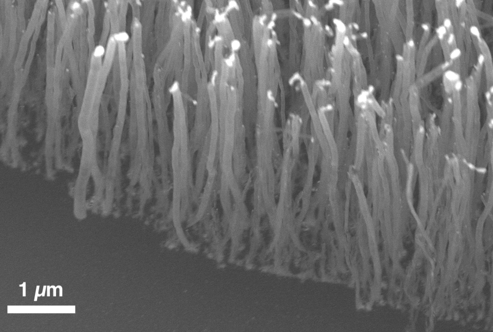

# Global setup (1 point bonus)

1. Unzip the `Exam_2021.zip` file somewhere on your computer in a `Exam_2021` folder, and rename the Rmd file as `name_firstname.Rmd`. You will work in this Rmd file and send it to me (**just the Rmd file**) by email at the end, at **colin.bousige@univ-lyon1.fr**. Change the name of the author in the YAML header to your own name, but don't touch anything else. *You will get a 1 point bonus if the file you sent me can be knitted without error*, even if you didn't finish the whole exercise: so, comment out any non-working code.
2. Create a new Rstudio project based on this `Exam_2021` folder.
3. All plots should be performed using `ggplot2`.
4. Load the libraries `tidyverse`{.R} and `broom` and set the global `ggplot2`{.R} theme to `theme_bw()`{.R}.

```{r, include=params$sol, warning = FALSE, cache=FALSE}
library(tidyverse)
library(broom)
theme_set(theme_bw())
```

---


```{r SEM, echo=FALSE, fig.cap="An SEM image of VACNTs.", fig.align="center", out.width="90%"}

```

# A bit of context

In this exam, we will analyze data from the study of the growth parameters of Vertically Aligned Carbon Nanotubes (VACNTs) as synthesized by Plasma Enhanced CVD (PECVD). The ultimate goal is to determine the various parameters governing the growth speed. As you all know from your class with C. Journet, in a PECVD process for growing VACNTs, we:

1. First make catalyst (Ni) nanoparticles at the surface of the substrate by unwetting in H~2~
2. Then we send in the carbon source (C~2~H~2~) with plasma. 
3. The carbon atoms then diffuse within the catalyst nanoparticles, and are eventually kicked out of the particles, which results in nanotubes growing along the potential lines of the applied voltage difference (*i.e.*, vertically).


The length $L$ of the resulting VACNTs, which is measured by SEM image analysis (Fig. \@ref(fig:SEM)), evolves linearly with the time, such as:

\begin{equation}
L=\alpha t
(\#eq:L)
\end{equation}
where $t$ is the duration of the acetylene insertion (in seconds), and $\alpha$ is the growth factor (in $\mu$m/sec). This growth factor follows an Arrhenius law, such as:

\begin{equation}
\alpha = \alpha_0 e^{-E_a/RT}
(\#eq:alpha)
\end{equation}
with:

- $\alpha_0$ a frequency factor (of the order of $\sim10^6$ Hz)
- $E_a$ the activation energy (of the order of $\sim100$ kJ/mol)
- $R$ the perfect gas constant ($R=8.314$ J/K/mol)
- $T$ the synthesis temperature (in K)

> In this exam, we will seek to determine $E_a$ through the analysis of nanotubes length distributions in various synthesis conditions.


# The actual exercise

Here, we assume that we performed VACNTs growth with varying times and temperatures, and then measured the resulting tube lengths using SEM. The images are treated with `ImageJ`, and the tube length distributions are saved into .csv files in the `Data` folder, with information on the sample temperature and time conditions in the file names. 

```{r, include=FALSE, eval=FALSE, warning=FALSE, message=FALSE}
R <- 8.314
T <- seq(800, 975, 25)
Ea <- rnorm(length(T), mean=151e3, sd=1000)
alpha <- 10000000*exp(-Ea/R/T)
t <- c(5,10,15,20)*60
for (tt in t) {
    for (i in 1:length(T)) {
        time <- ifelse(tt>=900, paste0(tt/60,"-min"), paste0(tt,"-sec"))
        LENGTH <- sample(100:300, 1)
        SD <- runif(1, min = alpha[i] * tt * .05, max = alpha[i] * tt * .2)
        totlength <- runif(1, min=alpha[i] * tt*.95, max=alpha[i] * tt*1.05)
        distrib <- tibble(L=round(rnorm(LENGTH, mean=totlength, sd=SD),3))
        write_csv(distrib, glue::glue("./Data/{T[i]}K_{time}.csv"), col_names = FALSE)
    }   
}
```

1. Store into `flist` all .csv file names in the `Data` folder.

```{r, include=params$sol, warning=FALSE, message=FALSE}
flist <- list.files(path="Data", pattern="csv", full.names = TRUE)
```

2. Read all these files in to a tidy `tibble` named `data`, that will contain two columns: `file`, and `L`.

```{r, include=params$sol, warning=FALSE, message=FALSE}
data <- read_csv(flist, 
                 col_names = c("L"), 
                 id = "file", 
                 show_col_types = FALSE
                )
```

3. You can note that the person who did the image treatment, in the specific aim of complicating *your* life, was not consistent in his way of writing the files, as time units vary from file to file. 
    1. Separate the `file` column into three columns, `temperature`, `time`, and `time_unit`.
    2. Make sure to turn the temperature column into a numeric value by removing unnecessary characters.
    3. Make sure that all times are in seconds, and then remove the `time_unit` column. You may want to use the `ifelse()`{.R} function to correct the `time` column by the appropriate coefficient.

```{r, include=params$sol, warning=FALSE, message=FALSE}
data <- data %>% 
    mutate(file = basename(file)) %>% 
    separate(file, c("temperature", "time", "time_unit", NA), convert = TRUE) %>% 
    mutate(temperature = as.numeric(gsub("K", "", temperature)),
           time = ifelse(time_unit == "min", time*60, time)) %>% 
    select(-time_unit)
```

4. Before going further, we want to make sure that the distributions are normal and monomodal. Plot the histograms of tube length on a grid, with the time as a function of the temperature and free *x* and *y* axis so that we can better see the distributions.

```{r, include=params$sol, warning=FALSE, message=FALSE, fig.cap="Histogram of VACNTs length as a function of synthesis time and temperature.", out.width="75%", fig.align="center"}
data %>% 
    ggplot(aes(x = L, fill=factor(time))) +
       geom_histogram() +
       labs(x="L [µm]", y="Counts", fill="Time [s]") +
       facet_grid(reorder(paste(time,"s"), time) ~ 
                  paste(temperature,"K"), 
                  scales="free")+
       theme(strip.background = element_blank(), 
             strip.text = element_text(face="bold"),
             legend.position = "none",
             text=element_text(size=9))
```

5. As we can see on the previous histograms, the distributions are normal and monomodal. We can thus compute the average and standard deviation of the lengths distributions. For each temperature and time, store these summarized quantities into a tibble named `means`, that will thus contain the columns `temperature`, `time`, `L_mean` and `L_sd`.

```{r, include=params$sol, warning=FALSE, message=FALSE}
means <- data %>% 
    group_by(temperature, time) %>% 
    summarize(L_mean = mean(L),
              L_sd = sd(L))
write_csv(means, "OMG_please_save_me/means.csv")
```

> In case you didn't manage to get there, you can continue by running:
> ```r
> means <- read_csv("OMG_please_save_me/means.csv")
> ```

6. Plot with points and error bars the time evolution of `L_mean` with a color depending on the temperature. Add lines coming from the linear fitting of these data -- without explicitly performing the fit (*i.e.* use a `ggplot2` smoothing function...).

```{r, include=params$sol, warning=FALSE, message=FALSE, fig.align="center"}
means %>%
    ggplot(aes(x = time, y = L_mean, color = factor(temperature))) +
    geom_point() +
    geom_errorbar(aes(ymin = L_mean - L_sd, ymax = L_mean + L_sd), width = 1) +
    geom_smooth(method = "lm", se = FALSE) +
    labs(x = "Time [s]", y = "L [µm]", col = "Temperature [K]")
```

7. Now we want to fit the linear evolution as described in Eq. \@ref(eq:L) for each temperature. We will do so using the `tidyverse` to avoid doing `for` loops. Starting from `means`, successively (*i.e.* using pipe operations):
    1. Nest the data for $L$ (and its error) vs time for each temperature. You should get a tibble with 2 columns, `temperature` and `data_tofit`, the latter being a list of tibbles with 4 lines and 3 columns (namely `time`, `L_mean` and `L_sd`).
    2. Create a column named `fit` that will contain the result of **map**ping the `lm()` function onto the `data_tofit` column to fit the evolution of `L_mean` as a function of `time`. In the call of `lm()`, make sure that you force a 0 value for the intercept, and that you use $1/\sigma_L^2$ as weights – with $\sigma_L$ the error on $L$.
    3. Create a column named `tidified` that will contain the result of **map**ping the `tidy()` function on the `fit` column. 
    4. Then unnest this `tidified` column.
    5. Rename the `estimate` and `std.error` columns into `alpha` and `d_alpha`.
    6. Remove the unnecessary columns, *i.e.* keep only the `temperature`, `alpha` an `d_alpha` ones.
    7. Store this into a tibble called `alphas`.

```{r, include=params$sol, warning=FALSE, message=FALSE}
alphas <- means %>% 
    nest(data_tofit = -temperature) %>% 
    mutate(fit = map(data_tofit, ~lm(.$L_mean ~ .$time+0, weights = 1/.$L_sd^2)),
           tidified = map(fit, tidy)) %>% 
    unnest(tidified) %>% 
    rename(alpha = "estimate", d_alpha = "std.error") %>% 
    select(-c(data_tofit, fit, term, statistic, p.value))
write_csv(alphas, "OMG_please_save_me/alphas.csv")
```

> In case you didn't manage to get there, you can continue by running:
> ```r
> alphas <- read_csv("OMG_please_save_me/alphas.csv")
> ```

8. Create a function `arrhenius(a0,Ea,T)` that, given `a0`, `Ea` and `T` will return the $\alpha$ value (as defined in Eq. \@ref(eq:alpha)).

```{r, include=params$sol, warning=FALSE, message=FALSE}
arrhenius <- function(a0,Ea,T) {
    a0*exp(-Ea/8.314/T)
}
```

9. Fit the data of $\alpha=f(T)$ from the `alphas` tibble using the `arrhenius()` function you just defined in order to get the `a0` and the `Ea` parameters. Make sure to use the proper weights ($1/\sigma_\alpha^2$) and to use proper starting values for `a0` and `Ea` (see the Context section). Print (**not** copy the result and paste it) the value of `Ea` and its determination error in kJ/mol (with the proper significant numbers). Compare to the expected value of 151 kJ/mol that I used when simulating these data.

```{r, include=params$sol, warning=FALSE, message=FALSE}
fit <- alphas %>%
    nls(data=., alpha ~ arrhenius(a0, Ea, temperature), weights = 1/d_alpha^2, 
        start = list(a0=1e6, Ea=100e3))
Ea <- round(tidy(fit)$estimate[2] / 1000, 0)
dEa <- round(tidy(fit)$std.error[2] / 1000, 0)
paste("Ea =",Ea,"±",dEa,"kJ/mol")
```

10. Plot the $\alpha=f(T)$ with corresponding error bars, and overlay a line corresponding to the fit to make sure the fit was properly made. For this, either use the `augment()` function, or create a tibble containing the fitted evolution of $\alpha$ with temperature for various temperatures in the studied range.

```{r, include=params$sol, warning=FALSE, message=FALSE, fig.align="center"}
Ea <- tidy(fit)$estimate[2]
a0 <- tidy(fit)$estimate[1]
fitted <- tibble(temperature=seq(800, 975, 1), 
                 alpha=arrhenius(a0, Ea, temperature))
alphas %>% 
    ggplot(aes(x = temperature, y = alpha)) +
       geom_point()+
       geom_errorbar(aes(ymin=alpha-d_alpha, ymax=alpha+d_alpha), width=0)+
       geom_line(data=fitted, col="red")+
       labs(x="Temperature [K]", y=expression(alpha))
```


