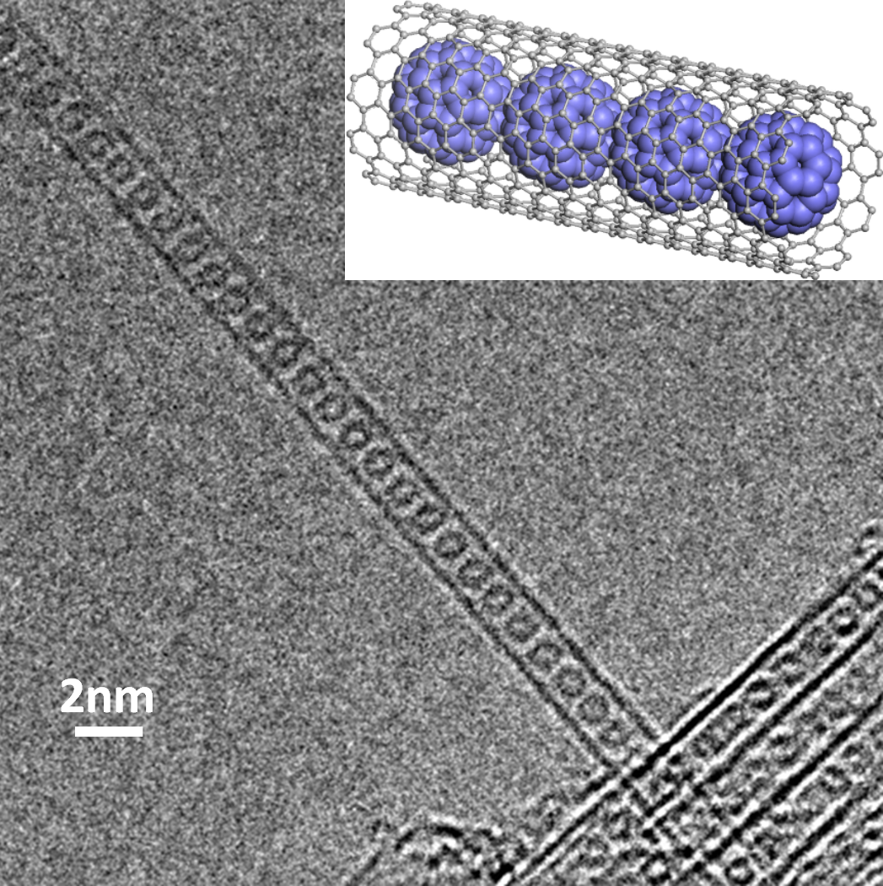

```{r, echo=FALSE}
knitr::opts_chunk$set(fig.align = "center")
```

# Global setup (1 point bonus)

1. Unzip the `Exam_2022.zip` file somewhere on your computer in a `Exam_2022` folder, and rename the Rmd file as `name_firstname.Rmd`. You will work in this Rmd file and send it to me (**just the Rmd file**) by email at the end, at **colin.bousige@univ-lyon1.fr**. Change the name of the author in the YAML header to your own name, but don't touch anything else. *You will get a 1 point bonus if the file you sent me can be knitted without error*, even if you didn't finish the whole exercise: so, comment out any non-working code.
2. Create a new Rstudio project based on this `Exam_2022` folder.
3. All plots should be performed using `ggplot2`.
4. Load the libraries `tidyverse`{.R} and `broom`{.R} and set the global `ggplot2`{.R} theme to `theme_bw()`{.R}.

In the following, you'll either write your own code or  fill the missing `...` parts in the given code. **Write your code within code blocks only!**

```{r, include=params$sol, warning = FALSE, cache=FALSE, message=FALSE}
library(tidyverse)
library(broom)
theme_set(theme_bw())
```

---

# A bit of context 

> Don't worry, you don't need to know anything related to it to do the exam!

```{r peapods, echo=FALSE, fig.cap="A TEM micrograph of carbon nanopeapods.", fig.align="center", out.width="35%"}

```

In this exam, we're going to determine the activation energy of the rotation of C~60~ fullerene molecules in carbon nanopeapods (Fig. \@ref(fig:peapods)), i.e. C~60~\@SWNT.
For this, we've performed Inelastic Neutron Scattering spectroscopy at the Institute Laue Langevin in Grenoble.
The signal we'll be working on is a quasi-elastic signal arising from the rotational motion of the fullerenes, and you'll see that the signal is evolving with temperature on a certain range of temperatures, while it's constant below a critical temperature.

This is due to the fact that the rotation of the molecules is an activated process: below a certain temperature the thermal fluctuations are not enough to overcome the energy barrier, and the molecules rotations are locked. Above the critical temperature the rotations are allowed, and the molecules show a diffusive rotation with a statistics following an Arrhenius law.


> The width of the quasi-elastic signal is directly related to the amplitude of the rotations. In the following, we want to determine **(1)** the evolution of the signal's width with temperature, and then **(2)** determine the activation energy of the process by fitting an Arrhenius law to this evolution.

# Data wrangling

1. Using `list.files()`{.R}, find all `xxK.csv` files in the folder `Data/`, where `xx` is the temperature. You'll store the result in a vector called `flist`. 

```{r include=params$sol, warning = FALSE, cache=FALSE, message=FALSE}
flist <- list.files(path = "Data", pattern = "K.csv", full.names = TRUE)
```

2. These files all contain 2 columns, `w` and `int`. Using `read_csv()`{.R}, load all these files into a tidy tibble called `df`, with the columns `T`, `w` and `int`. Using a combination of `as.numeric()`{.R}, `basename()`{.R} and `str_replace()`{.R}, make sure the column `T` contains the temperatures as numerical values.

```{r include=params$sol, warning = FALSE, cache=FALSE, message=FALSE}
df <- read_csv(flist, id = "T") %>% 
    mutate(T = str_replace(T,"K.csv","") %>% basename() %>% as.numeric())
```

> In case you didn't manage to get there, you can continue by running:
> ```r
> df <- read_csv("Data/alldata.csv")
> ```

# Plotting and fitting the data

3. Now we have loaded our data, let's take a look at it. Try to make a plot looking like this:

```{r echo=params$sol, warning = FALSE, cache=FALSE, message=FALSE}
colors <- colorRampPalette(c("black","royalblue","seagreen","orange","red"))
df %>% 
    ggplot(aes(x = w, y = int + as.numeric(factor(T))*.1, color=T)) +
       geom_point(alpha=0.5, size=.5)+
       scale_color_gradientn(colours = colors(50))+
       labs(x="Energy Transfer [meV]",
            y="Intensity [arb. units]",
            color="T [K]")
```

4. Now we see that all signals are Gaussian peaks centered around 0 meV with a varying width. A Gaussian is defined using the function `dnorm(w, mean=w0, sd=FW)`{.R}. Modify the following code to fit all the peaks using the `nls()`{.R} function.

```{r include=params$sol, warning = FALSE, cache=FALSE, message=FALSE}
df_fit <- df %>% 
    nest(data = -T) %>% 
    mutate(fit = map(data, 
                     ~nls(data = ., 
                          int ~ dnorm(w, sd = sd, mean = 0),
                          start = list(sd = 1))
                     ),
           tidied = map(fit, tidy),
           augmented = map(fit, augment))
```

5. Now let's check that our fit is good by adding a red line to the previous plot, the red line being the result of the fit. For this, we will use the `.fitted` column of the unnested `augmented` column. 

```{r include=params$sol, warning = FALSE, cache=FALSE, message=FALSE}
df_fit %>% 
    unnest(augmented) %>% 
    ggplot(aes(x = w, y = int + as.numeric(factor(T)) * .1, group=T)) +
        geom_point(alpha = 0.5, size = .5) +
        geom_line(aes(y=.fitted + as.numeric(factor(T)) * .1), color="red") +
        labs(x = "Energy Transfer [meV]",
             y = "Intensity [arb. units]",
             color = "T [K]")
```

6. Let's simplify our `df_fit` tibble so that it only contains 3 columns, `T`, `FW` and `dFW`, `FW` and `dFW` being the result of the fit and the corresponding standard error.

```{r include=params$sol, warning = FALSE, cache=FALSE, message=FALSE}
df_fit_sorted <- df_fit %>% 
    unnest(tidied) %>% 
    select(T, estimate, std.error) %>% 
    rename(FW="estimate", 
           dFW="std.error")
```


# Fitting the Arrhenius law

> In case you didn't manage to get there, you can continue by running:
> ```r
> df_fit_sorted <- read_csv("Data/FW_fit_results.csv")
> ```

7. Now let's plot our results to see the evolution of the width with temperature. Add vertical errorbars corresponding to the standard error on the fit, like so:

```{r echo=params$sol, warning = FALSE, cache=FALSE, message=FALSE}
df_fit_sorted %>% 
    ggplot(aes(x = T, y = FW, ymin=FW-dFW, ymax=FW+dFW)) +
       geom_point(size=1)+
       geom_errorbar(width=0)+
       labs(x = "Temperature [K]",
            y = "Width [meV]")
```

8. You see that below a certain temperature, there is no evolution of the width, as discussed at the beginning. Create a subset of the `df_fit_sorted` tibble only containing data for which the width evolves with temperature.

```{r include=params$sol, warning = FALSE, cache=FALSE, message=FALSE}
df_fit_sorted_tofit <- df_fit_sorted %>% 
    filter(T>=100)
```

9. Now let's perform the fit of the data using an Arrhenius law like below, where `FW` is the width of the signal. You can either consider it a nonlinear model (and fit it with `nls()`{.R}) or a linear one (and fit it with `lm()`{.R}. In that case, you'll need to add a column containing the `1/T` values to perform your fit).

$$
FW = FW_0 \times e^{-E_a/k_BT}
$$

```{r include=params$sol, warning = FALSE, cache=FALSE, message=FALSE}
fit <- nls(data = df_fit_sorted_tofit,
           FW ~ A * exp(-Ea/T),
           start = list(A=1, Ea=90))
df_fit_sorted_tofit$tt <- 1/df_fit_sorted_tofit$T
fitlin <- lm(data = df_fit_sorted_tofit,
           log(FW) ~ tt)
```

10. Plot the result of the fit to make sure it's good, like so:

```{r echo=params$sol, warning = FALSE, cache=FALSE, message=FALSE}
df_fit_sorted %>% 
    ggplot(aes(x = T, y = FW, ymin=FW-dFW, ymax=FW+dFW)) +
       geom_line(data = df_fit_sorted_tofit,
                 aes(y=predict(fit)), color="red")+
       geom_point(size=1)+
       geom_errorbar(width=0)+
       labs(x = "Temperature [K]",
            y = "Width [meV]")
```

11. What is the value of the activation energy, in Kelvins (with standard error)? Does it make sense to you when seeing the width evolution with temperature?

```{r include=params$sol, warning = FALSE, cache=FALSE, message=FALSE}
Ea <- round(tidy(fit) %>% filter(term == "Ea") %>% .$estimate)
dEa <- round(tidy(fit) %>% filter(term == "Ea") %>% .$std.error)
paste("Ea = ", Ea, "±", dEa)
Ea <- -round(tidy(fitlin) %>% filter(term == "tt") %>% .$estimate)
dEa <- round(tidy(fitlin) %>% filter(term == "tt") %>% .$std.error)
paste("Ea = ", Ea, "±", dEa)
```
