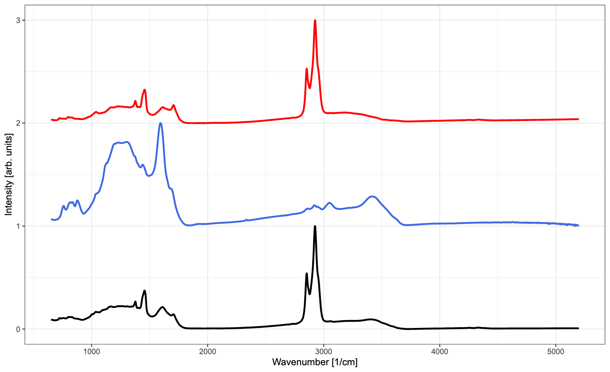
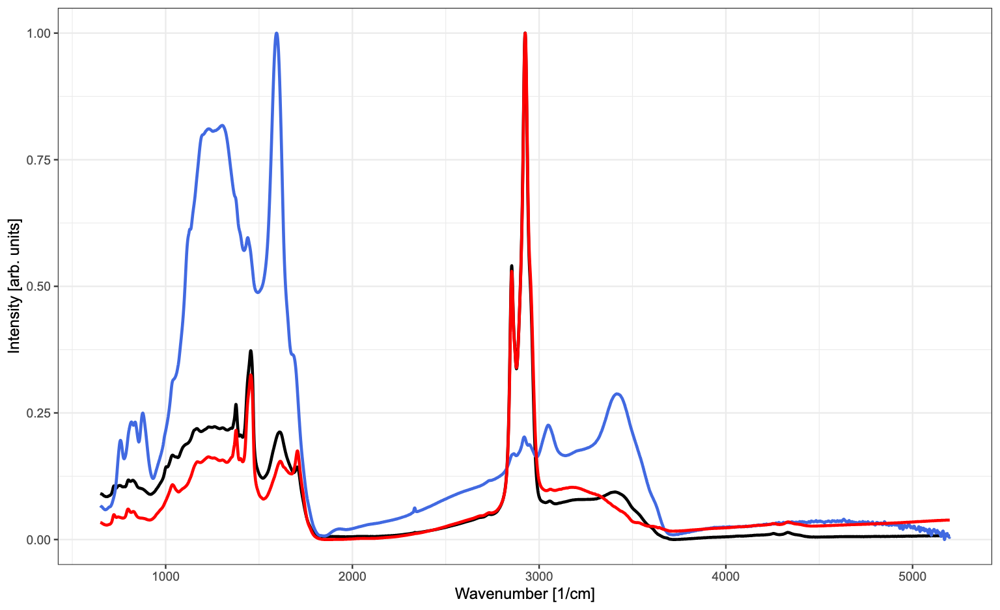

- Load the `readxl` and `tidyverse` libraries.

```{r include=TRUE, warning = FALSE, message=FALSE, cache=FALSE}

```

- Load <a href="Data/FTIR_rocks.xlsx" download target="_blank">FTIR_rocks.xlsx</a> into a `data.frame` (in fact, `tibble`).

```{r include=TRUE, warning = FALSE, message=FALSE, cache=FALSE}

```

- Rename the columns with simpler names, such as "w", "r1", "r2" and "r3"

```{r include=TRUE, warning = FALSE, message=FALSE, cache=FALSE}

```

- Find the wavenumber value of the maximum of each spectrum

```{r include=TRUE, warning = FALSE, message=FALSE, cache=FALSE}

```

- Create a function `norm01()` that, given a vector, returns the vector normalized to [0,1]

```{r include=TRUE, warning = FALSE, message=FALSE, cache=FALSE}

```

- Normalize all columns of FTIR intensity to [0,1]

```{r include=TRUE, warning = FALSE, message=FALSE, cache=FALSE}

```

- Using base graphics or `ggplot2`, as you wish, try to reproduce the following graphs:

```{r plots, echo=FALSE, fig.cap="", fig.align="center", out.width="50%"}


```

```{r include=TRUE, warning = FALSE, message=FALSE, cache=FALSE}

```

