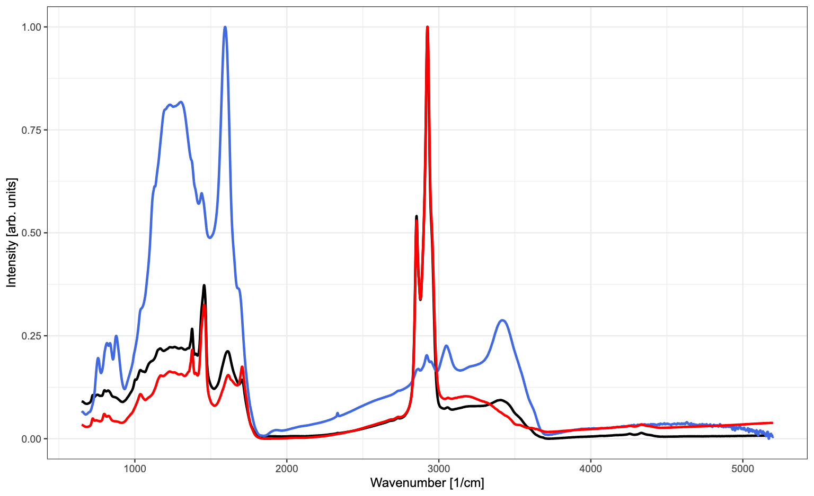

- Load the `readxl` and `tidyverse` libraries.

```{r include=TRUE, warning = FALSE, message=FALSE, cache=FALSE}
library(readxl)
library(tidyverse)
```

- Load `FTIR_rocks.xlsx` into a `data.frame` (in fact, `tibble`).

```{r include=TRUE, warning = FALSE, message=FALSE, cache=FALSE}
# Place the Rmd file you are working on in the same folder as the one containing the "Data" folder
# If you do so, the path is relative to where your working Rmd file is located :
df <- read_excel("Data/FTIR_rocks.xlsx")
# Otherwise, you need to provide the whole absolute path
# df <- read_excel("/Users/colin/Downloads/Data/FTIR_rocks.xlsx")
```

- Rename the columns with simpler names, such as "w", "r1", "r2" and "r3"

```{r include=TRUE, warning = FALSE, message=FALSE, cache=FALSE}
names(df) <- c("w","r1","r2","r3")
```

- Find the wavenumber value of the maximum of each spectrum

```{r include=TRUE, warning = FALSE, message=FALSE, cache=FALSE}
max1 <- df$w[which.max(df$r1)]
max2 <- df$w[which.max(df$r2)]
max3 <- df$w[which.max(df$r3)]
max1;max2;max3
```

- Create a function `norm01()` that, given a vector, returns the vector normalized to [0,1]

```{r include=TRUE, warning = FALSE, message=FALSE, cache=FALSE}
norm01 <- function(x){
    (x-min(x))/(max(x)-min(x))
}
# check it's working
x <- 1:10
norm01(x)
```

- Normalize all columns of FTIR intensity to [0,1]

```{r include=TRUE, warning = FALSE, message=FALSE, cache=FALSE}
# First, let's make the tibble tidy
df_tidy <- df %>% pivot_longer(cols=-w,
                    names_to="rock",
                    values_to="intensity")
df_tidy
# now add the new column 'intensity_n' containing the normalized intensities
df_tidy <- df_tidy %>% 
    group_by(rock) %>%
    mutate(intensity_n = norm01(intensity))
df_tidy
```

- Using base graphics or `ggplot2`, as you wish, try to reproduce the following graphs:

```{r plots, echo=FALSE, fig.cap="", fig.align="center", out.width="50%"}
knitr::include_graphics("Data/plot1.png")

```

```{r include=TRUE, warning = FALSE, message=FALSE, cache=FALSE}
P1 <- df_tidy %>%
    ggplot(aes(x=w, y=intensity_n, color=rock)) +
        # add the lines with thickness of 1
        geom_line(size=1) +
        # change the axis labels
        labs(x="Wavenumber [1/cm]", y="Intensity [arb. units]") +
        theme_bw() +
        # set the color to the wanted colors and give a name to 
        # the legend if you want to plot the legend
        # if this line is absent, ggplot uses its default colors (blue, red, green)
        scale_color_manual(values = c("black", "royalblue", "red"), name="Rock:") +
        # to remove the legend, set it to "none"
        # if you remove this line, the default is to show the legend on the right
        theme(legend.position = "top")
P2 <- df_tidy %>%
    ggplot(aes(x=w, 
               y=intensity_n + as.numeric(factor(rock)) - 1, 
               color=rock)) +
        geom_line(size=1)+
        labs(x="Wavenumber [1/cm]", y="Intensity [arb. units]")+
        theme_bw()+
        theme(legend.position = "none")+
        scale_color_manual(values = c("black", "royalblue", "red"))
library(patchwork)
P1+P2
```

