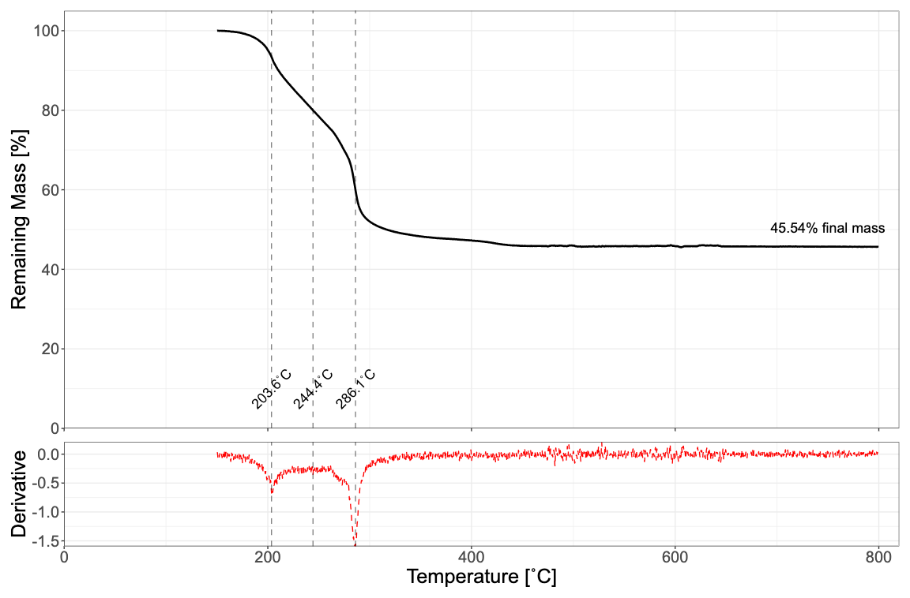

```{r echo=FALSE, warning=FALSE, message=FALSE, fig.align="center"}
library(downloadthis)
download_link(
  link = "https://github.com/colinbousige/rclass/raw/main/Exo/tga/Archive.zip",
  output_name = "Data Files",
  button_label = "Download Data Files",
  button_type = "default",
  has_icon = TRUE,
  icon = "fa fa-save",
  self_contained = FALSE
)
```
<br>

----


We're going to work on the <a href="Data/TGA.txt" download target="_blank">TGA.txt</a> file, which contains the TGA of an aqueous solution of single-walled carbon nanotubes individualized by the addition of polymers and surfactants. What we want to know is:

- at what temperature does the material decompose?
- what is the mass percentage of metal catalyst in the sample?
- 
Before importing the data, the first thing to do is look at its structure.

- How many lines in the header need to be skipped?
- Are there any lines of text at the end that shouldn't be read?
- How are the data columns separated?
- Are there column names?
- Are there any comments?

--- 

**1.** Knowing all this, let's import the data into a `dataframe` called `tga`:

- Load the `tidyverse` package
- Download the TGA data file <a href="Data/TGA.txt" download target="_blank">TGA.txt</a>
- Load it into a `tibble` using the `read_table()`{.R} function - refer to the help for the correct parameters to use..

```{r include=params$solution, warning = FALSE, message=FALSE, cache=FALSE}
library(tidyverse)
tga <- read_table("Data/TGA.txt", 
                  skip=12,
                  col_names=c("Index","t","Tset","Tread","Mass"), 
                  n_max=4088)
```


--- 

**2.** This data is made up of 5 columns:

- `Index`: measurement index
- `t`: elapsed time since start of measurement in seconds
- `Tset`: imposed temperature in ˚C
- `Tread`: Temperature read in ˚C
- `Mass`: Sample mass in mg

Before any further processing, we need to take a look at our data. Using `ggplot2`, plot the `Mass` column against the `Tread` column using a black line and formatting the axis texts to show the units. Is there a problem? Check out what `geom_path()` will do.

```{r include=params$solution, warning = FALSE, message=FALSE, cache=FALSE}
p0 <- tga %>% 
    ggplot(aes(x = Tread, y = Mass)) +
        geom_path() +
        labs(x="Temperature [˚C]", y="Mass [mg]") +
        theme_bw()
p0
```

--- 

**3.** You can see from this representation that some data ranges are to throw away: the cooling section, and the vertical drop at the start - this is due to the fact that the sample was in a sample changer, and lost water while waiting for the measurement to start.

So, modify `tga` to remove these two data ranges, and plot it again.

```{r include=params$solution, warning = FALSE, message=FALSE, cache=FALSE}
tga_filtered <- tga %>% 
        filter(t < t[which.max(Tread)], # Remove data from the temperature decrease
               Tread > min(Tread))      # Remove repeated data at the beginning
# Define nice axis labels with the units
tga_filtered %>% 
    ggplot(aes(x = Tread, y = Mass)) +
        geom_line() +
        labs(x="Temperature [˚C]", y="Mass [mg]") +
        theme_bw()
```

--- 

**4.** Finally, in TGA, we're interested in mass variation, not absolute mass.

- What do you think is responsible for the (large) loss of mass before 150˚C?
- Create a new `RemainingMass` column that will contain the percentage of remaining sample mass of individualized nanotubes.

```{r include=params$solution, warning = FALSE, message=FALSE, cache=FALSE}
Mref <- tga_filtered %>% filter(abs(Tread-150)<.1) %>% pull(Mass)
tga_filtered$RemainingMass <- tga_filtered$Mass/Mref[1]*100
```

--- 

**5.** Now plot the percentage of mass remaining as a function of temperature, zooming in on the part we're interested in (i.e. not solvent evaporation).

```{r include=params$solution, warning = FALSE, message=FALSE, cache=FALSE}
p0 <- tga_filtered %>% 
    ggplot(aes(x = Tread, y = RemainingMass)) +
        geom_line(linewidth=1) +
        coord_cartesian(ylim=c(0,105), xlim=c(0,820), expand = FALSE) +
        scale_y_continuous(breaks = seq(0, 100, 20)) +
        labs(x="Temperature [˚C]", y="Remaining Mass [%]") +
        theme_bw()
p0
```

--- 

**6.** As mentioned above, this is a sample of single-walled carbon nanotubes individualized by the addition of polymers and surfactants. What we want to know is:

- At what temperature does the material decompose?
- What is the mass percentage of metal catalyst in the sample?
- With the above in mind, and looking at the graph above, can you think of another question to ask about this sample?

In ATG, the decomposition temperature of a compound is said to be reached when the ATG curve reaches an inflection point. Determining the position of these inflection points is done by determining the position of the local extrema in the first derivative of the curve.

Using the `diff()`{.R} function, implement a `derivative(x,y)` function that returns the first derivative $\partial y/\partial x$ given two vectors x and y. Make this function return a `dataframe` with column names `x` and `y`.

Then, use this function to calculate `d_tga`, the derivative of `RemainingMass` with respect to `Tread` for `Tread>150`.

```{r include=params$solution, warning = FALSE, message=FALSE, cache=FALSE}
# first derivative
derivative <- function(x, y) {
    # returns dy/dx
    dy <- diff(y)/diff(x)           # the actual derivative
    dx <- x[-length(x)] + diff(x)/2 # centers the X values
    tibble(x = dx, y = dy)
}
# alternatively, derivative at any order:
derivative <- function(x, y, n=1) {
    # returns d^ny/dx^n
    d <- tibble(x = x, y = y)
    if(n>0){
        for (i in seq_along(n)) {
            dy <- diff(d$y)/diff(d$x)             # the actual derivative
            dx <- d$x[-length(d$x)] + diff(d$x)/2 # centers the X values
            d  <- tibble(x = dx, y = dy)
        }
    }
    d
}
tga_filtered <- tga_filtered %>% filter(Tread>150)
d_tga <- derivative(tga_filtered$Tread, tga_filtered$RemainingMass, n=1)
```

--- 

**7.** We will now determine the position of the local minima and save them in an `inflpoints` list.

To do this, use [this thread on stackoverflow](https://stackoverflow.com/questions/6836409/finding-local-maxima-and-minima). We want to keep only the inflection points below 400˚C, and as the derivative curve is noisy we'll use the `span=150` parameter to work on smoothed data (you can play with this parameter to see its effects).

```{r include=params$solution, warning = FALSE, message=FALSE, cache=FALSE}
library(ggpmisc)
y <- d_tga %>% filter(x<400) %>% pull(y)
x <- d_tga %>% filter(x<400) %>% pull(x)
inflpoints <- x[ggpmisc:::find_peaks(-y, span=150)]
```

--- 

**8.** Now try to reproduce the graph below (without "hardcoding" any values, of course!):

```{r plot, echo=FALSE, fig.cap="", fig.align="center", out.width="80%"}

```


```{r include=params$solution, warning = FALSE, message=FALSE, cache=FALSE}
# Add the derivative in a red dashed line in a panel below the previous graph
# Zoom on the data to see the variations
library(patchwork)
p2 <- d_tga %>% 
    ggplot(aes(x=x, y=y), color="red") +
        geom_line(col="red", lty=2) +
        labs(x="Temperature [˚C]", y="Derivative") +
        coord_cartesian(xlim=c(0,820), expand = FALSE) +
        geom_vline(xintercept = inflpoints, lty=2, alpha=.5)+
        theme_bw()
# Remove the x label of the top panel and have the same x axis for both panels
p1 <- p0 + geom_vline(xintercept = inflpoints, lty=2, alpha=.5)+
        theme_bw() +
        theme(axis.title.x=element_blank(),
               axis.text.x=element_blank())+
        annotate("text", x=750, y=min(tga_filtered$RemainingMass)+5, 
                 label=glue::glue("{round(min(tga_filtered$RemainingMass),2)}% final mass"), size=5)+
        annotate("text",x=inflpoints, y=10, 
                  label=glue::glue("{round(inflpoints,1)}˚C"), 
                  size=5, angle=45)
p1/p2+ plot_layout(heights = c(4, 1))&theme(text=element_text(size=20))
```