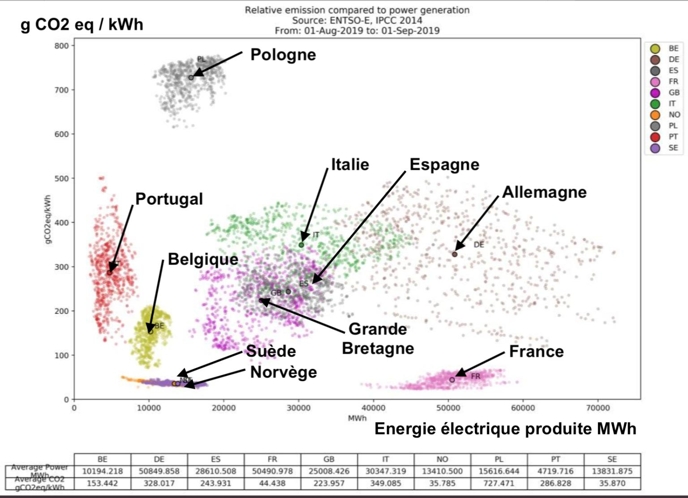

# First part

## This is a title | with a subtitle

This is $LATEX_{text}$ and an equation:

$$
  f\left(k\right) = \binom{n}{k} p^k\left(1-p\right)^{n-k}
$$


### This is a subtitle or boxed text...

... it depends on the beamer theme used.

This is a reference to an article [@fake_article] and a book [@ashcroft_solid_1976].


### This is another one...
Test

---

This slide does not have a title.
These bullet points show incrementally due to the `incremental: true` parameter:

- Test
- Test2


## This is a new slide

Some text

```{r anRchunk, warning = FALSE, message = FALSE, fig.cap="This is an interactive figure", echo=FALSE, out.height="300px"}
library(ggplot2)
library(plotly)
theme_set(theme_bw())
P <- ggplot(mtcars, aes(mpg, cyl)) + geom_point()
ggplotly(P, dynamicTicks = TRUE)
```
Text after columns. And this is a reference to Fig. \@ref(fig:anRchunk).

## And here we insert an external figure

Some text on top

<div style="float: left; width: 40%;">
```{r echo = FALSE, fig.cap = 'Some jpg figure on the left', out.width="100%"}

```
</div>
<div style="float: right; width: 60%;">
```{r echo = FALSE, fig.cap = 'Some jpg figure on the right', out.width="100%"}

```
</div>

Some text at the bottom


## References
More informations here: https://bookdown.org/yihui/rmarkdown/ioslides-presentation.html