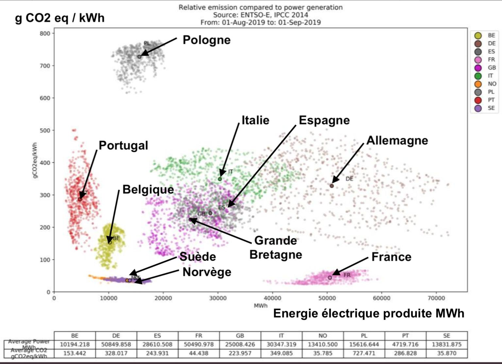

# This is a title

This a footnote[^1], this is $LATEX_{text}$ and an equation:

$$
  f\left(k\right) = \binom{n}{k} p^k\left(1-p\right)^{n-k}
$$

[^1]: And this is a footnote

## This is a subtitle or boxed text...

... it depends on the beamer theme used.

This is a reference to an article [@fake_article] and a book [@ashcroft_solid_1976].


## This is another one...
Test

---

This slide does not have a title.
These bullet points show directly:

- Test
- Test2

While these bullet points show incrementally:

>- Test
>- Test 2

# This is a new slide

Text before columns.

:::: {.columns}

::: {.column width=70%}
```{r anRchunk, fig.cap="This is a caption for a figure", echo=FALSE}
library(ggplot2)
theme_set(theme_bw())
ggplot(mtcars, aes(mpg, cyl)) + geom_point()
```
:::

::: {.column width=30%}
Some text on the right
:::

::::

Text after columns. And this is a reference to Fig. \@ref(fig:anRchunk).

# And here we insert an external figure


:::: {.columns}

::: {.column}
```{r echo = FALSE, fig.cap = 'Some external pdf figure', out.width="100%"}
knitr::include_graphics('./plots_fits.pdf')
```
:::

::: {.column}
```{r echo = FALSE, fig.cap = 'Some external jpg figure', out.width="100%"}

```
:::

::::


# References

More information here: https://bookdown.org/yihui/rmarkdown/beamer-presentation.html