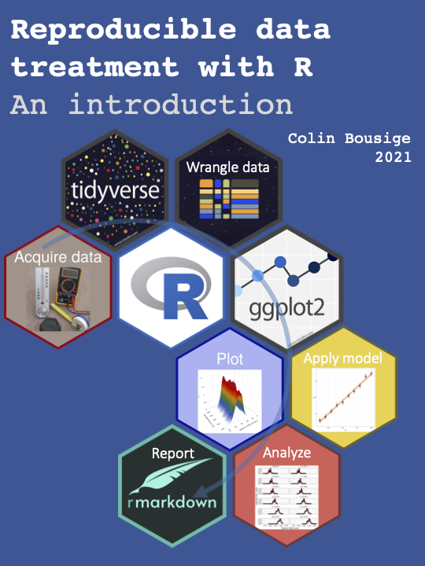

<!-- 
Render with:
system("rm -rf _main.Rmd _book/ _main_files/ _book_files/")
bookdown::render_book("index.Rmd", "bookdown::bs4_book")
system("./upload.sh")
-->


# Welcome {.unnumbered}

```{r include=FALSE}
library(knitr)
knitr::opts_chunk$set(cache = FALSE, out.width='100%', warnings=FALSE, message=FALSE)
options(width = 80)
```

```{r name, echo=FALSE, fig.cap="", fig.align="center", out.width="60%"}

```


## Author {.unnumbered}

[Colin BOUSIGE](mailto:colin.bousige@cnrs.fr) -- CNRS Researcher, Laboratoire des Multimatériaux et Interfaces, Lyon, France

## License {.unnumbered}

This book and its code samples are licensed to you under [MIT](https://opensource.org/licenses/MIT).
